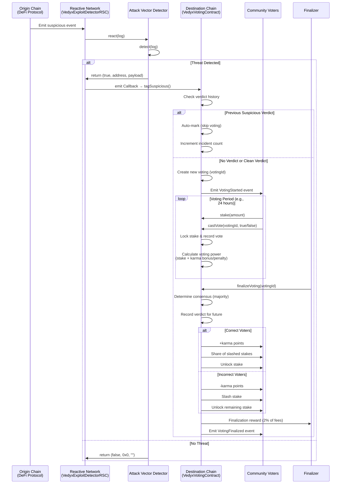

# Vedyx Network

**Decentralized security consensus through stake-backed governance.**

## 📋 Overview
Vedyx Protocol is a **decentralized security system** that combines **exploit detection**, **community governance**, and **stake-based voting** to identify and respond to suspicious blockchain activity across multiple EVM chains.

## Documentation

- **[Voting Contract Guide](./src/VOTING_CONTRACT_GUIDE.md)** - Complete guide to stake-based voting, karma system, penalties, and RBAC
- **[Reactive Contracts](./src/reactive-contracts/README.md)** - Singleton architecture for modular exploit detection

## Quick Start

```bash
# Install dependencies
forge install

# Run tests
forge test

# Deploy (configure RPC endpoints first)
forge script script/Deploy.s.sol --broadcast
```

---

## 🏗️ Architecture (3-Layer System)

```
┌─────────────────────────────────────────────────────────────────────────┐
│                          ORIGIN CHAIN (e.g., Ethereum)                   │
│                                                                           │
│  ┌──────────────────┐         ┌──────────────────┐                      │
│  │  DeFi Protocol   │         │  Malicious Actor │                      │
│  │  (Uniswap, etc.) │         │                  │                      │
│  └────────┬─────────┘         └────────┬─────────┘                      │
│           │                             │                                │
│           │ Emits Events                │ Suspicious Transaction         │
│           └─────────────────────────────┘                                │
│                                 │                                        │
└─────────────────────────────────┼────────────────────────────────────────┘
                                  │
                                  ▼
┌─────────────────────────────────────────────────────────────────────────┐
│                         REACTIVE NETWORK                                 │
│                                                                           │
│  ┌────────────────────────────────────────────────────────────────┐    │
│  │           VedyxExploitDetectorRSC (Singleton Hub)              │    │
│  │                                                                 │    │
│  │  ┌──────────────────────────────────────────────────────┐     │    │
│  │  │           Detector Registry                          │     │    │
│  │  │  topic_0 → [Detector1, Detector2, Detector3, ...]   │     │    │
│  │  └──────────────────────────────────────────────────────┘     │    │
│  │                                                                 │    │
│  │  react(log) {                                                  │    │
│  │    detectors = registry[log.topic_0]                          │    │
│  │    for each detector:                                          │    │
│  │      if detector.detect(log) → emit Callback                  │    │
│  │  }                                                              │    │
│  └─────────────────────────────┬───────────────────────────────────┘    │
│                                │                                        │
│      ┌─────────────────┐  ┌─────────────────┐                           │
│      │ LargeTransfer   │  │   FlashLoan     │                           |
│      │ Detector        │  │   Detector      │   ...                     │
│      └─────────────────┘  └─────────────────┘                           │
│                                │                                        │
│                                │ Callback Payload                       │
└────────────────────────────────┼────────────────────────────────────────┘
                                 │
                                 ▼
┌─────────────────────────────────────────────────────────────────────────┐
│                    DESTINATION CHAIN (e.g., Ethereum)                    │
│                                                                           │
│  ┌────────────────────────────────────────────────────────────────┐    │
│  │                   VedyxVotingContract                           │    │
│  │                                                                 │    │
│  │  • Verdict-based auto-classification                           │    │
│  │  • Stake-weighted voting with karma system                     │    │
│  │  • Finalization rewards & penalty distribution                 │    │
│  │  • Role-based access control (RBAC)                            │    │
│  └────────────────────────────────────────────────────────────────┘    │
│                                                                           │
│  ┌────────────────────────────────────────────────────────────────┐    │
│  │                      Staking Token (ERC20)                      │    │
│  │  • Users stake to gain voting power                             │    │
│  │  • Locked during active votes                                   │    │
│  │  • Slashed for incorrect votes                                  │    │
│  └────────────────────────────────────────────────────────────────┘    │
└─────────────────────────────────────────────────────────────────────────┘
```

### **Layer 1: Reactive Network (Detection Layer)**
- **VedyxExploitDetectorRSC** - Singleton reactive smart contract on Reactive Network
- **Modular Detector System** - Pluggable attack vector detectors via `IAttackVectorDetector` interface
- **Current Detector**: `LargeTransferDetector` - Monitors ERC20 Transfer events for abnormally large transfers
- **How it works**:
  1. Subscribes to high-risk event signatures across multiple chains
  2. ReactVM calls `react()` for every matching log
  3. Delegates to registered detectors based on `topic_0`
  4. Emits `Callback` to destination chain when threat detected

### **Layer 2: Destination Chain (Governance Layer)**
- **VedyxVotingContract** - Main governance contract with modular architecture
- **Modular Components**:
  - [VedyxTypes.sol](cci:7://file:///Users/harishkumargunjalli/GitHub/vedyx-protocol/src/voting-contract/libraries/VedyxTypes.sol:0:0-0:0) - Data structures (Staker, Vote, Voting, SuspiciousReport, AddressVerdict)
  - [VedyxErrors.sol](cci:7://file:///Users/harishkumargunjalli/GitHub/vedyx-protocol/src/voting-contract/libraries/VedyxErrors.sol:0:0-0:0) - Custom error definitions
  - [VotingPowerLib.sol](cci:7://file:///Users/harishkumargunjalli/GitHub/vedyx-protocol/src/voting-contract/libraries/VotingPowerLib.sol:0:0-0:0) - Voting power calculations with karma effects
  - [VotingResultsLib.sol](cci:7://file:///Users/harishkumargunjalli/GitHub/vedyx-protocol/src/voting-contract/libraries/VotingResultsLib.sol:0:0-0:0) - Penalty/reward distribution logic
  - [IVedyxVoting.sol](cci:7://file:///Users/harishkumargunjalli/GitHub/vedyx-protocol/src/voting-contract/interfaces/IVedyxVoting.sol:0:0-0:0) - Contract interface

### **Layer 3: Community Voting**
- **Stake-based voting** - Users stake ERC20 tokens to participate
- **Karma system** - Tracks voter accuracy
  - Correct votes: +10 karma (linear bonus to voting power)
  - Incorrect votes: -5 karma (exponential penalty to voting power)
  - Threshold: -50 karma blocks voting
- **Penalty/Reward mechanism**:
  - Incorrect voters lose 10% of stake
  - Penalties distributed to correct voters proportionally
  - 1% finalization fee goes to treasury

---

## Voting Flow


---

## 🔑 Key Features

### **1. Voting Mechanics**
- Minimum stake required to vote
- Voting power = stake × karma modifiers
- Time-bound voting periods
- Consensus determined by voting power (not vote count)
- Locked stakes during active votes

### **2. Karma System**
```
Voting Power Calculation:
- Positive karma: Linear bonus (stake + stake × karma / 1000)
- Negative karma: Exponential penalty (stake - stake × karma² / 100000)
```

### **3. Verdict System**
- Tracks historical verdicts per address
- Auto-marks addresses as suspicious after threshold
- Governance can clear verdicts
- Prevents duplicate voting on same address

### **4. Role-Based Access Control**
- `GOVERNANCE_ROLE` - Set core parameters (voting duration, penalty %, minimum stake)
- `PARAMETER_ADMIN_ROLE` - Set karma rewards/penalties, finalization reward %
- `TREASURY_ROLE` - Manage treasury address, fee percentage, fee transfers
- `DEFAULT_ADMIN_ROLE` - Owner has all permissions

---

## 📁 File Structure

```
src/
├── voting-contract/
│   ├── VedyxVotingContract.sol          # Main contract
│   ├── libraries/
│   │   ├── VedyxTypes.sol               # Structs
│   │   ├── VedyxErrors.sol              # Custom errors
│   │   ├── VotingPowerLib.sol           # Voting power logic
│   │   └── VotingResultsLib.sol         # Penalty/reward logic
│   └── interfaces/
│       └── IVedyxVoting.sol             # Contract interface
├── reactive-contracts/
│   ├── VedyxExploitDetectorRSC.sol      # Reactive detector hub
│   ├── IAttackVectorDetector.sol        # Detector interface
│   └── detectors/
│       └── LargeTransferDetector.sol    # Transfer monitor
└── VOTING_CONTRACT_GUIDE.md             # Comprehensive guide

test/
├── VedyxVotingContract.t.sol            # Core functionality tests (65 tests)
├── VoterRewards.t.sol                   # Reward distribution tests (8 tests)
├── VerdictSystem.t.sol                  # Verdict tracking tests (19 tests)
├── NegativeKarma.t.sol                  # Karma penalty tests (4 tests)
└── AccessControl.t.sol                  # RBAC tests (38 tests)
```

---

## 🔄 Complete Workflow

1. **Detection**: Reactive Network detector identifies suspicious transaction
2. **Callback**: Detector emits callback to `VedyxVotingContract.tagSuspicious()`
3. **Voting Initiated**: New voting session created with suspicious address details
4. **Community Votes**: Stakers cast votes (true = suspicious, false = not suspicious)
5. **Finalization**: After voting period, anyone can finalize
6. **Consensus**: Voting power determines outcome (not vote count)
7. **Penalties Applied**: Incorrect voters lose 10% stake
8. **Rewards Distributed**: Penalties distributed to correct voters (minus 1% fee)
9. **Karma Updated**: Correct voters +10 karma, incorrect voters -5 karma
10. **Verdict Recorded**: Address marked suspicious if consensus agrees

---

## 💾 Key Data Structures

```solidity
struct Staker {
    uint256 stakedAmount;
    uint256 lockedAmount;
    int256 karmaPoints;
    uint256 totalVotes;
    uint256 correctVotes;
}

struct Voting {
    uint256 votingId;
    SuspiciousReport report;
    uint256 startTime;
    uint256 endTime;
    uint256 votesFor;
    uint256 votesAgainst;
    uint256 totalVotingPower;
    bool finalized;
    bool isSuspicious;
    mapping(address => Vote) votes;
    address[] voters;
}

struct AddressVerdict {
    bool hasVerdict;
    bool isSuspicious;
    uint256 lastVotingId;
    uint256 verdictTimestamp;
    uint256 totalIncidents;
}
```

---

## 🎯 Design Principles

1. **Modularity** - Libraries separate concerns for gas efficiency and maintainability
2. **Security-First** - Comprehensive access control and validation
3. **Community-Driven** - Decentralized decision-making via staking
4. **Incentive Alignment** - Karma system rewards accuracy
5. **Cross-Chain** - Reactive Network enables multi-chain monitoring
6. **Extensibility** - Pluggable detector architecture

---

## 🔧 Key Parameters (Configurable)

- `MINIMUM_STAKE` - Required stake to vote (default: 100 ether)
- `VOTING_DURATION` - Voting period length (default: 3 days)
- `PENALTY_PERCENTAGE` - Incorrect voter penalty (default: 1000 = 10%)
- `FINALIZATION_FEE_PERCENTAGE` - Treasury fee (default: 100 = 1%)
- `KARMA_REWARD` - Karma for correct vote (default: 10)
- `KARMA_PENALTY` - Karma for incorrect vote (default: -5)
- `MINIMUM_KARMA_TO_VOTE` - Karma threshold (default: -50)
- `AUTO_MARK_THRESHOLD` - Auto-suspicious threshold (default: 3)

---

## 🚀 Current Status

- ✅ Modular architecture implemented
- ✅ All tests passing (134/134)
- ✅ Documentation updated
- ✅ Ready for Uniswap V4 hook integration
- 🔄 Considering: MEV protection, liquidity guard, karma-based fees

---
