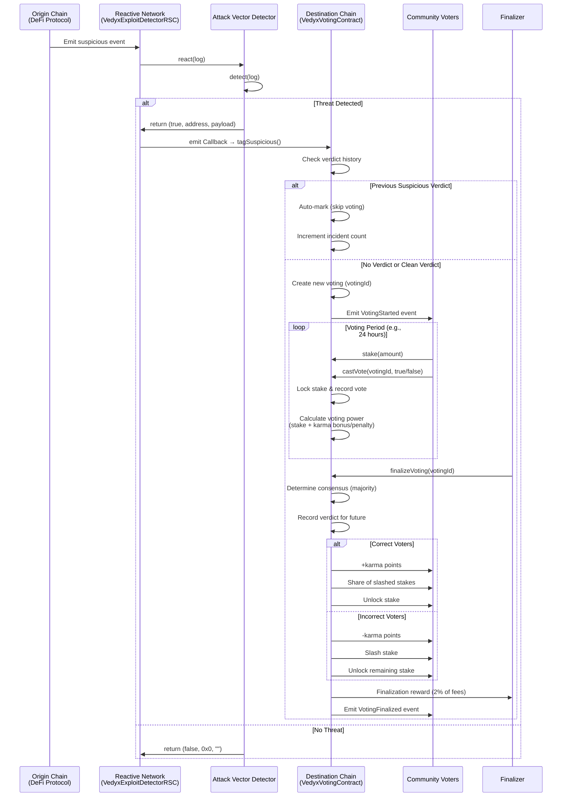

# Vedyx Protocol

**Decentralized security consensus through stake-backed governance.**

Vedyx introduces a new primitive for on-chain security: **risk consensus**. By combining real-time threat detection with economic stake-weighted voting, Vedyx enables the DeFi community to collectively validate and respond to suspicious on-chain activity.

## Architecture

```
┌─────────────────────────────────────────────────────────────────────────┐
│                          ORIGIN CHAIN (e.g., Ethereum)                   │
│                                                                           │
│  ┌──────────────────┐         ┌──────────────────┐                      │
│  │  DeFi Protocol   │         │  Malicious Actor │                      │
│  │  (Uniswap, etc.) │         │                  │                      │
│  └────────┬─────────┘         └────────┬─────────┘                      │
│           │                             │                                │
│           │ Emits Events                │ Suspicious Transaction         │
│           └─────────────────────────────┘                                │
│                                 │                                        │
└─────────────────────────────────┼────────────────────────────────────────┘
                                  │
                                  ▼
┌─────────────────────────────────────────────────────────────────────────┐
│                         REACTIVE NETWORK                                 │
│                                                                           │
│  ┌────────────────────────────────────────────────────────────────┐    │
│  │           VedyxExploitDetectorRSC (Singleton Hub)              │    │
│  │                                                                 │    │
│  │  ┌──────────────────────────────────────────────────────┐     │    │
│  │  │           Detector Registry                          │     │    │
│  │  │  topic_0 → [Detector1, Detector2, Detector3, ...]   │     │    │
│  │  └──────────────────────────────────────────────────────┘     │    │
│  │                                                                 │    │
│  │  react(log) {                                                  │    │
│  │    detectors = registry[log.topic_0]                          │    │
│  │    for each detector:                                          │    │
│  │      if detector.detect(log) → emit Callback                  │    │
│  │  }                                                              │    │
│  └─────────────────────────────┬───────────────────────────────────┘    │
│                                │                                        │
│  ┌─────────────────┐  ┌────────┴────────┐  ┌──────────────────┐       │
│  │ LargeTransfer   │  │   FlashLoan     │  │  Reentrancy      │       │
│  │ Detector        │  │   Detector      │  │  Detector        │  ...  │
│  └─────────────────┘  └─────────────────┘  └──────────────────┘       │
│                                │                                        │
│                                │ Callback Payload                       │
└────────────────────────────────┼────────────────────────────────────────┘
                                 │
                                 ▼
┌─────────────────────────────────────────────────────────────────────────┐
│                    DESTINATION CHAIN (e.g., Ethereum)                    │
│                                                                           │
│  ┌────────────────────────────────────────────────────────────────┐    │
│  │                   VedyxVotingContract                           │    │
│  │                                                                 │    │
│  │  • Verdict-based auto-classification                           │    │
│  │  • Stake-weighted voting with karma system                     │    │
│  │  • Finalization rewards & penalty distribution                 │    │
│  │  • Role-based access control (RBAC)                            │    │
│  └────────────────────────────────────────────────────────────────┘    │
│                                                                           │
│  ┌────────────────────────────────────────────────────────────────┐    │
│  │                      Staking Token (ERC20)                      │    │
│  │  • Users stake to gain voting power                             │    │
│  │  • Locked during active votes                                   │    │
│  │  • Slashed for incorrect votes                                  │    │
│  └────────────────────────────────────────────────────────────────┘    │
└─────────────────────────────────────────────────────────────────────────┘
```

## Voting Flow



## Core Components

| Component | Status | Description |
|-----------|--------|-------------|
| **VedyxVotingContract** | 🚧 In Progress | Stake-weighted voting with karma tracking & penalties |
| **VedyxExploitDetectorRSC** | 🚧 In Progress | Modular threat detection on Reactive Network |
| **Attack Vector Detectors** | 📋 Planned | Pluggable detection modules (flash loans, etc.) |

## Documentation

- **[Voting Contract Guide](./src/VOTING_CONTRACT_GUIDE.md)** - Complete guide to stake-based voting, karma system, penalties, and RBAC
- **[Reactive Contracts](./src/reactive-contracts/README.md)** - Singleton architecture for modular exploit detection

## Quick Start

```bash
# Install dependencies
forge install

# Run tests
forge test

# Deploy (configure RPC endpoints first)
forge script script/Deploy.s.sol --broadcast
```

## Key Features

- ✅ **Stake-based voting** with karma-weighted power
- ✅ **Exponential penalties** for incorrect votes
- ✅ **Verdict-based auto-classification** for repeat offenders
- ✅ **Role-based access control** (Governance, Parameter Admin, Treasury)
- ✅ **Modular detection system** with pluggable attack vector detectors
- ✅ **Finalization rewards** to incentivize timely vote resolution

## Built With

- [Foundry](https://book.getfoundry.sh/) - Smart contract development
- [Reactive Network](https://reactive.network/) - Cross-chain event detection
- [OpenZeppelin](https://www.openzeppelin.com/contracts) - Security & access control

---

**Status Legend:** ✅ Complete | 🚧 In Progress | 📋 Planned
