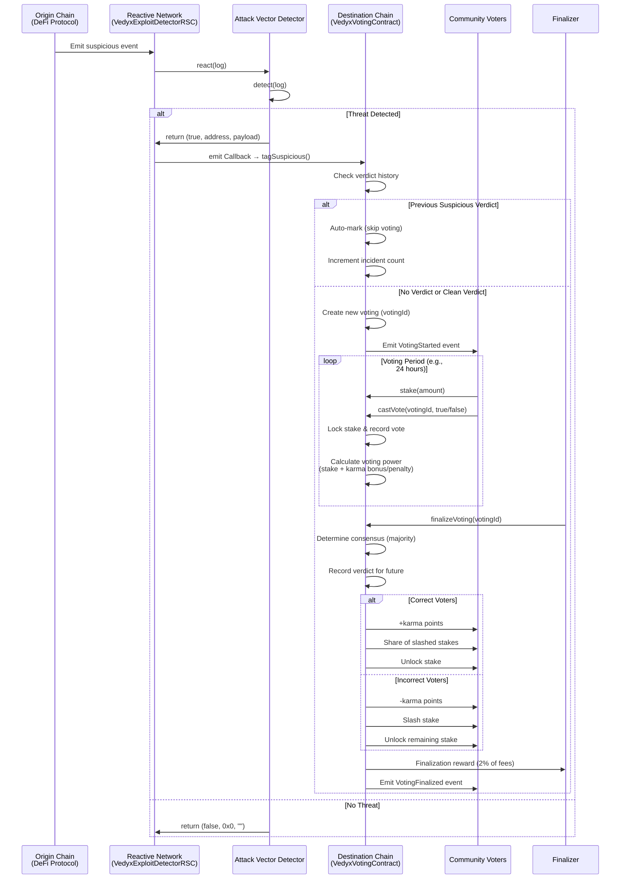

# Vedyx Network

**Decentralized security consensus through stake-backed governance.**

## 📋 Overview
Vedyx is a **community-driven address reputation platform** that tracks and flags addresses involved in exploits **after they occur**. Instead of preventing exploits (which happen in various ways), Vedyx focuses on the **aftermath** — when attackers attempt to cash out stolen funds through DEX pools or mixers.

### The Problem
- Exploits happen in countless ways (flash loans, reentrancy, price manipulation, etc.)
- **The real vulnerability is the cashout phase** — attackers need to convert stolen assets
- Current solutions lack community consensus and are centralized
- No unified dashboard to track exploit addresses across chains

### The Solution
Vedyx provides:
1. **One-stop dashboard** to understand exploit addresses and their on-chain activity
2. **Stake-weighted community voting** to determine address suspiciousness
3. **Economic disincentives** for attackers trying to manipulate votes (requires massive stake)
4. **Risk scoring framework** for DeFi protocols to penalize or block suspicious addresses
5. **Karma-based reputation** ensuring voters are cautious and accurate

## Documentation

- **[Voting Contract Guide](./src/VOTING_CONTRACT_GUIDE.md)** - Complete guide to stake-based voting, karma system, penalties, and RBAC
- **[Reactive Contracts](./src/reactive-contracts/README.md)** - Singleton architecture for modular exploit detection

## Quick Start

```bash
# Install dependencies
forge install

# Run tests
forge test

# Deploy (configure RPC endpoints first)
forge script script/Deploy.s.sol --broadcast
```

---

## 🏗️ Architecture 

```
┌─────────────────────────────────────────────────────────────────────────┐
│                          ORIGIN CHAIN (e.g., Ethereum)                   │
│                                                                           │
│  ┌──────────────────┐         ┌──────────────────┐                      │
│  │  Exploit Occurs  │         │  Attacker Tries  │                      │
│  │  (Flash Loan,    │    →    │  to Cash Out     │                      │
│  │Large Transfers)  │         │  Stolen Funds    │                      │
│  └────────┬─────────┘         └────────┬─────────┘                      │
│           │                             │                                │
│           │ On-chain Activity           │ Large Transfers/Swaps          │
│           └─────────────────────────────┘                                │
│                                 │                                        │
└─────────────────────────────────┼────────────────────────────────────────┘
                                  │
                                  ▼
┌─────────────────────────────────────────────────────────────────────────┐
│                         REACTIVE NETWORK                                 │
│                                                                           │
│  ┌────────────────────────────────────────────────────────────────┐    │
│  │           VedyxExploitDetectorRSC (Monitoring Singleton Hub)   │    │
│  │                                                                 │    │
│  │  Monitors post-exploit cashout patterns:                       │    │
│  │  • Large token transfers (potential fund movement)             │    │
│  │  • Unusual swap patterns (converting stolen assets)            │    │
│  │  • High-value liquidity operations                             │    │
│  │  • Rapid cross-protocol fund movement                          │    │
│  │  ┌──────────────────────────────────────────────────────┐     │    │
│  │  │           Detector Registry                          │     │    │
│  │  │  topic_0 → [Detector1, Detector2, Detector3, ...]   │     │    │
│  │  └──────────────────────────────────────────────────────┘     │    │
│  │                                                                 │    │
│  │  react(log) {                                                  │    │
│  │    detectors = registry[log.topic_0]                          │    │
│  │    for each detector:                                          │    │
│  │      if detector.detect(log) → emit Callback                  │    │
│  │  }                                                              │    │
│  └─────────────────────────────┬───────────────────────────────────┘    │
│                                │                                        │
│      ┌─────────────────┐  ┌─────────────────┐                           │
│      │ LargeTransfer   │  │   FlashLoan     │                           |
│      │ Detector        │  │   Detector      │   ...                     │
│      └─────────────────┘  └─────────────────┘                           │
│                                │                                        │
│                                │ Callback Payload                       │
└────────────────────────────────┼────────────────────────────────────────┘
                                 │
                                 ▼
┌─────────────────────────────────────────────────────────────────────────┐
│                    DESTINATION CHAIN (e.g., Ethereum)                    │
│                                                                           │
│  ┌────────────────────────────────────────────────────────────────┐    │
│  │                   VedyxVotingContract                           │    │
│  │                                                                 │    │
│  │  • Verdict-based auto-classification                           │    │
│  │  • Stake-weighted voting with karma system                     │    │
│  │  • Finalization rewards & penalty distribution                 │    │
│  │  • Role-based access control (RBAC)                            │    │
│  └────────────────────────────────────────────────────────────────┘    │
│                                                                           │
│  ┌────────────────────────────────────────────────────────────────┐    │
│  │                      Staking Token (ERC20)                      │    │
│  │  • Users stake to gain voting power                             │    │
│  │  • Locked during active votes                                   │    │
│  │  • Slashed for incorrect votes                                  │    │
│  └────────────────────────────────────────────────────────────────┘    │
└─────────────────────────────────────────────────────────────────────────┘
```

### **Layer 1: Reactive Network (Monitoring Layer)**
- **VedyxExploitDetectorRSC** - Monitors on-chain activity for suspicious patterns
- **Modular Detector System** - Pluggable pattern detectors via `IAttackVectorDetector` interface
- **Current Detector**: `LargeTransferDetector` - Flags abnormally large ERC20 transfers (potential cashout attempts)
- **How it works**:
  1. Subscribes to relevant event signatures across multiple chains
  2. ReactVM calls `react()` for every matching log
  3. Delegates to registered detectors based on `topic_0`
  4. Emits `Callback` to destination chain when suspicious pattern detected

### **Layer 2: Destination Chain (Governance Layer)**
- **VedyxVotingContract** - Main governance contract with modular architecture
- **Modular Components**:
  - [VedyxTypes.sol](cci:7://file:///Users/harishkumargunjalli/GitHub/vedyx-protocol/src/voting-contract/libraries/VedyxTypes.sol:0:0-0:0) - Data structures (Staker, Vote, Voting, SuspiciousReport, AddressVerdict)
  - [VedyxErrors.sol](cci:7://file:///Users/harishkumargunjalli/GitHub/vedyx-protocol/src/voting-contract/libraries/VedyxErrors.sol:0:0-0:0) - Custom error definitions
  - [VotingPowerLib.sol](cci:7://file:///Users/harishkumargunjalli/GitHub/vedyx-protocol/src/voting-contract/libraries/VotingPowerLib.sol:0:0-0:0) - Voting power calculations with karma effects
  - [VotingResultsLib.sol](cci:7://file:///Users/harishkumargunjalli/GitHub/vedyx-protocol/src/voting-contract/libraries/VotingResultsLib.sol:0:0-0:0) - Penalty/reward distribution logic
  - [IVedyxVoting.sol](cci:7://file:///Users/harishkumargunjalli/GitHub/vedyx-protocol/src/voting-contract/interfaces/IVedyxVoting.sol:0:0-0:0) - Contract interface

### **Layer 3: Community Voting (Anti-Manipulation)**
- **Stake-weighted voting** - More stake = More voting power
  - **Key Insight**: Attackers would need massive stake to manipulate their own address reputation
  - If they acquire enough stake to vote themselves "not suspicious", they've essentially bought into the system
- **Karma system** - Ensures voters are cautious and accurate
  - Correct votes: +10 karma (linear bonus to voting power)
  - Incorrect votes: -5 karma (exponential penalty to voting power)
  - Threshold: -50 karma blocks voting
- **Economic Disincentives**:
  - Incorrect voters lose 10% of stake
  - Penalties distributed to correct voters proportionally
  - 1% finalization fee goes to treasury
  - **Result**: Voters are highly cautious, making vote manipulation expensive and risky

---

## Voting Flow


---

## 🔑 Key Features

### **1. Voting Mechanics**
- Minimum stake required to vote
- Voting power = stake × karma modifiers
- Time-bound voting periods
- Consensus determined by voting power (not vote count)
- Locked stakes during active votes

### **2. Karma System**
```
Voting Power Calculation:
- Positive karma: Linear bonus (stake + stake × karma / 1000)
- Negative karma: Exponential penalty (stake - stake × karma² / 100000)
```

### **3. Verdict System**
- Tracks historical verdicts per address
- Auto-marks addresses as suspicious after threshold
- Governance can clear verdicts
- Prevents duplicate voting on same address

### **4. Role-Based Access Control**
- `GOVERNANCE_ROLE` - Set core parameters (voting duration, penalty %, minimum stake)
- `PARAMETER_ADMIN_ROLE` - Set karma rewards/penalties, finalization reward %
- `TREASURY_ROLE` - Manage treasury address, fee percentage, fee transfers
- `DEFAULT_ADMIN_ROLE` - Owner has all permissions

---

## 📁 File Structure

```
src/
├── voting-contract/
│   ├── VedyxVotingContract.sol          # Main contract
│   ├── libraries/
│   │   ├── VedyxTypes.sol               # Structs
│   │   ├── VedyxErrors.sol              # Custom errors
│   │   ├── VotingPowerLib.sol           # Voting power logic
│   │   └── VotingResultsLib.sol         # Penalty/reward logic
│   └── interfaces/
│       └── IVedyxVoting.sol             # Contract interface
├── reactive-contracts/
│   ├── VedyxExploitDetectorRSC.sol      # Reactive detector hub
│   ├── IAttackVectorDetector.sol        # Detector interface
│   └── detectors/
│       └── LargeTransferDetector.sol    # Transfer monitor
└── VOTING_CONTRACT_GUIDE.md             # Comprehensive guide

test/
├── VedyxVotingContract.t.sol            # Core functionality tests (65 tests)
├── VoterRewards.t.sol                   # Reward distribution tests (8 tests)
├── VerdictSystem.t.sol                  # Verdict tracking tests (19 tests)
├── NegativeKarma.t.sol                  # Karma penalty tests (4 tests)
└── AccessControl.t.sol                  # RBAC tests (38 tests)
```

---

## 🔄 Complete Workflow (Post-Exploit)

1. **Exploit Occurs**: Attacker successfully exploits a protocol (various attack vectors)
2. **Cashout Attempt**: Attacker tries to convert/move stolen funds via DEX swaps or transfers
3. **Pattern Detection**: Reactive Network monitors flag suspicious on-chain activity (large transfers, unusual swaps)
4. **Callback**: Detector emits callback to `VedyxVotingContract.tagSuspicious()`
5. **Voting Initiated**: New voting session created with address details and on-chain evidence
6. **Community Analysis**: Stakers review on-chain activity via Vedyx dashboard
7. **Stake-Weighted Voting**: Community votes (true = suspicious, false = not suspicious)
   - Voting power = stake × karma modifiers
   - Attackers would need massive stake to manipulate votes
8. **Finalization**: After voting period, consensus determined by voting power
9. **Penalties/Rewards**: Incorrect voters lose 10% stake → distributed to correct voters
10. **Karma Updated**: Correct voters +10 karma, incorrect voters -5 karma
11. **Verdict Recorded**: Address flagged with suspiciousness score and risk level
12. **Protocol Integration**: DeFi protocols (Uniswap pools, etc.) can query verdict and apply:
    - Proportional penalties (higher fees for suspicious addresses)
    - Complete blocks (prevent trading in protected pools)
    - Slippage adjustments based on risk score

---

## 💾 Key Data Structures

```solidity
struct Staker {
    uint256 stakedAmount;
    uint256 lockedAmount;
    int256 karmaPoints;
    uint256 totalVotes;
    uint256 correctVotes;
}

struct Voting {
    uint256 votingId;
    SuspiciousReport report;
    uint256 startTime;
    uint256 endTime;
    uint256 votesFor;
    uint256 votesAgainst;
    uint256 totalVotingPower;
    bool finalized;
    bool isSuspicious;
    mapping(address => Vote) votes;
    address[] voters;
}

struct AddressVerdict {
    bool hasVerdict;
    bool isSuspicious;
    uint256 lastVotingId;
    uint256 verdictTimestamp;
    uint256 totalIncidents;
}
```

---

## 🎯 Design Principles

1. **Post-Exploit Focus** - We don't prevent exploits; we track and flag addresses afterward
2. **Cashout Prevention** - Target the attacker's exit strategy (DEX swaps, mixers)
3. **Economic Security** - Vote manipulation requires massive stake, making it economically unfeasible
4. **Community-Driven** - Decentralized consensus, not centralized blacklists
5. **Transparency** - One-stop dashboard for address reputation and on-chain evidence
6. **Incentive Alignment** - Karma system ensures voters are cautious and accurate
7. **Protocol Composability** - Risk scores enable DeFi protocols to make informed decisions
8. **Cross-Chain** - Reactive Network enables multi-chain address tracking

---

## 🔧 Key Parameters (Configurable)

- `MINIMUM_STAKE` - Required stake to vote (default: 100 ether)
- `VOTING_DURATION` - Voting period length (default: 3 days)
- `PENALTY_PERCENTAGE` - Incorrect voter penalty (default: 1000 = 10%)
- `FINALIZATION_FEE_PERCENTAGE` - Treasury fee (default: 100 = 1%)
- `KARMA_REWARD` - Karma for correct vote (default: 10)
- `KARMA_PENALTY` - Karma for incorrect vote (default: -5)
- `MINIMUM_KARMA_TO_VOTE` - Karma threshold (default: -50)
- `AUTO_MARK_THRESHOLD` - Auto-suspicious threshold (default: 3)

---

## 🚀 Current Status & Roadmap

### ✅ Implemented (Phase 1)
- Modular voting contract architecture
- Stake-weighted voting with karma system
- Reactive Network monitoring (LargeTransferDetector)
- All tests passing (134/134)
- Economic disincentives for vote manipulation

### 🔄 In Progress (Phase 2)
- **Vedyx Dashboard** - One-stop interface for address reputation
  - On-chain activity visualization
  - Voting history and evidence
  - Risk score calculation
- **Additional Detectors** - More cashout pattern monitors
  - DEX swap pattern detector
  - Cross-protocol fund movement tracker
  - Mixer interaction detector

### 📋 Planned (Phase 3)
- **Protocol Integration Framework**
  - Uniswap V4 hooks for suspicious address penalties
  - Risk-based fee adjustments
  - Pool access controls based on reputation
- **Advanced Risk Scoring** - Multi-factor address risk assessment
- **Cross-chain verdict aggregation**

---
