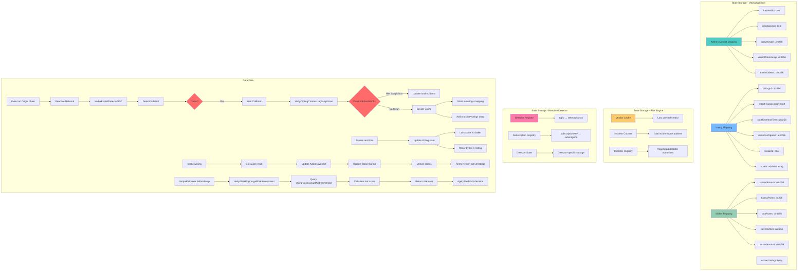
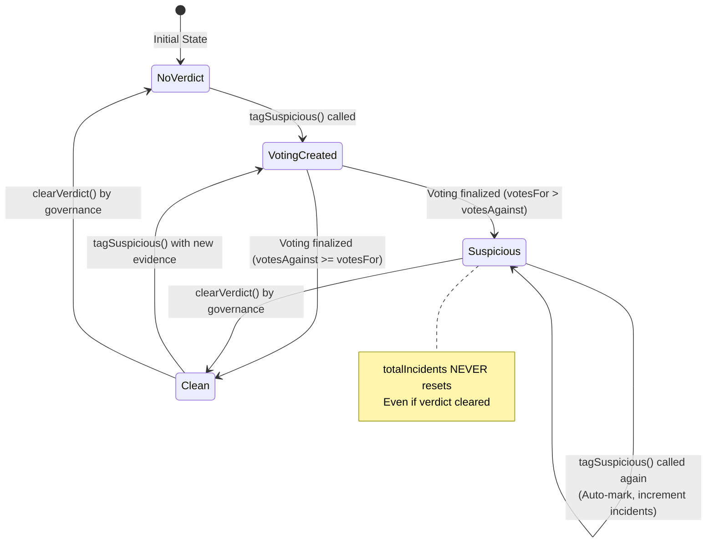
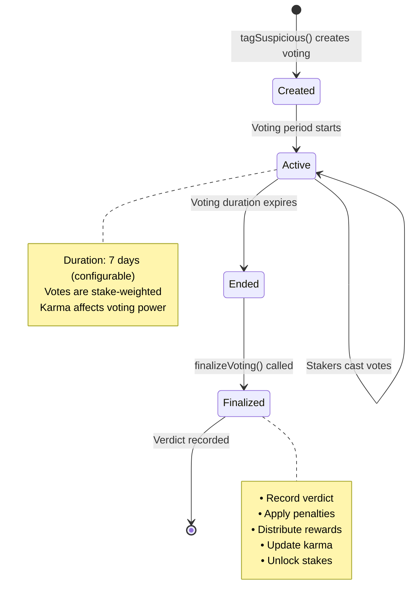
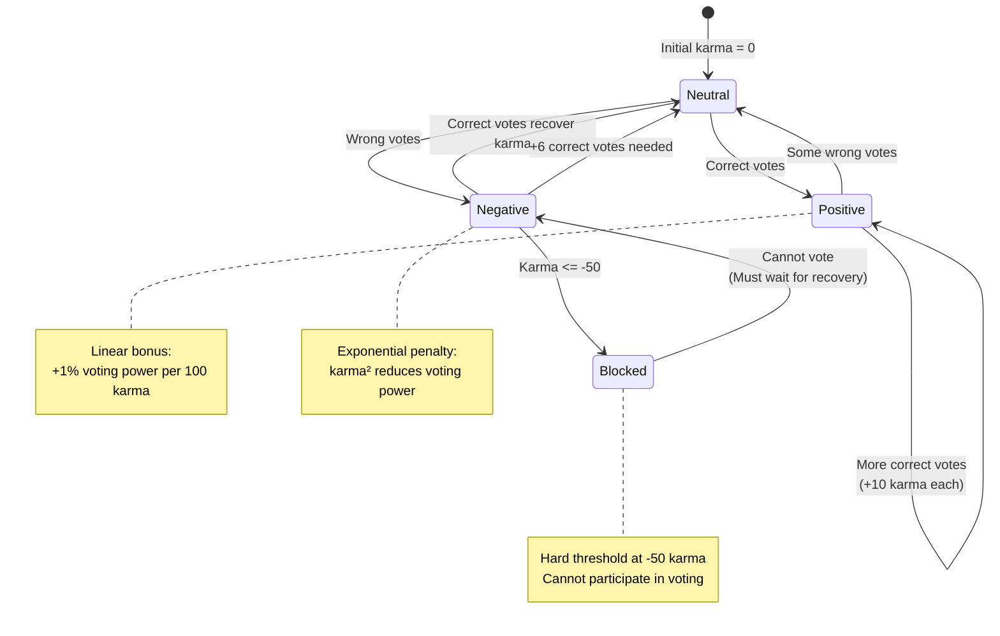
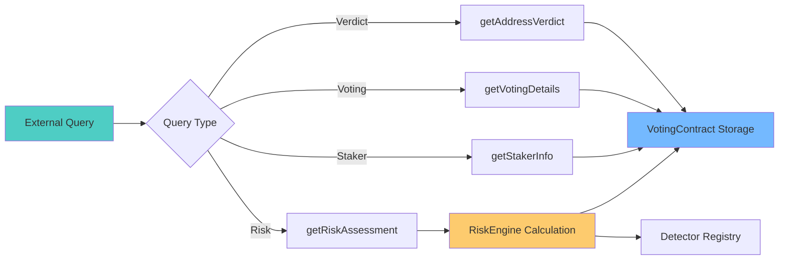
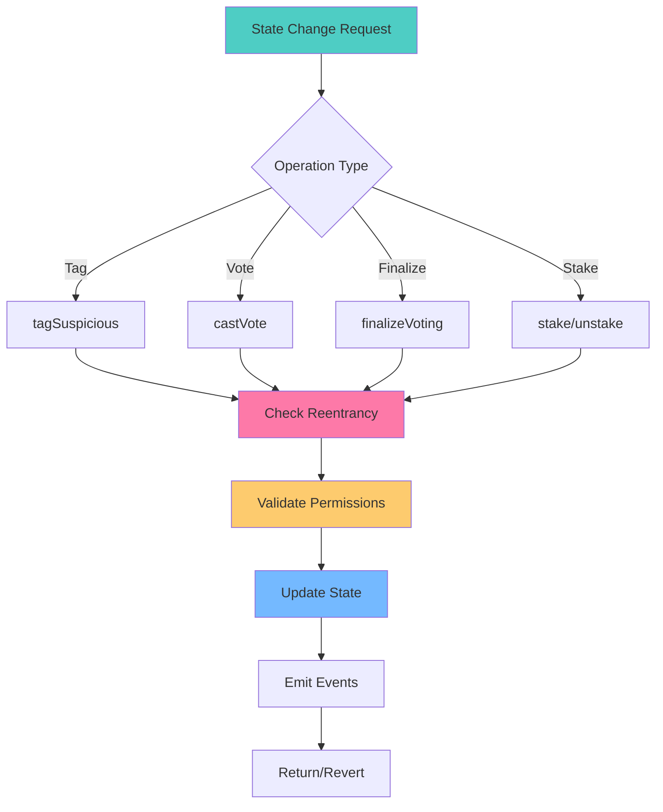
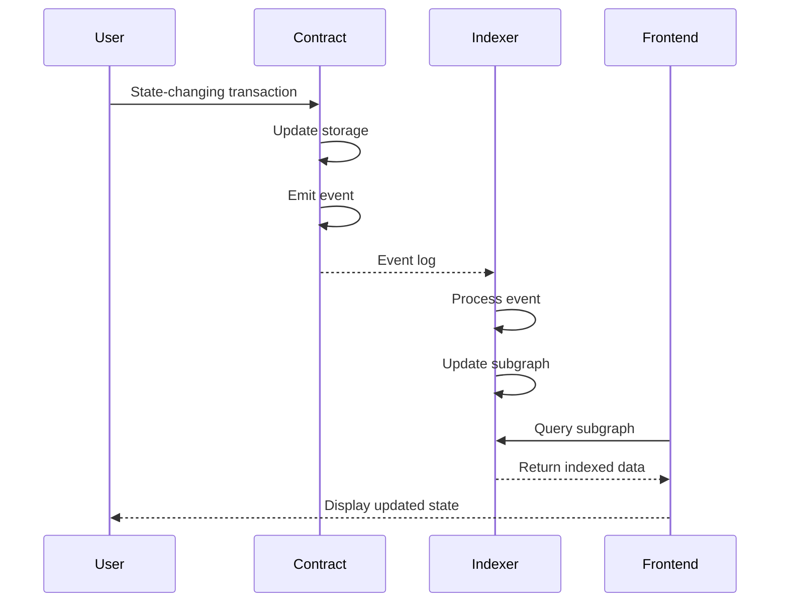

# Data Flow & State Management

## State Transitions

### AddressVerdict State Machine

### Voting Lifecycle

### Staker Karma Evolution

## Data Access Patterns

### Read Operations (View Functions)

### Write Operations (State Changes)

## Event Emission Flow

## Key Events

### Voting Contract Events

- `VotingStarted(votingId, address, chainId, ...)`
- `VotingFinalized(votingId, isSuspicious, votesFor, votesAgainst)`
- `VoteCast(votingId, voter, voteSuspicious, votingPower)`
- `SuspiciousAddressAutoMarked(address, totalIncidents)`
- `VerdictRecorded(address, isSuspicious, votingId)`
- `Staked(user, amount, totalStaked)`
- `Unstaked(user, amount, remainingStaked)`
- `KarmaUpdated(user, oldKarma, newKarma)`

### Risk Hook Events

- `SwapBlocked(user, riskLevel, riskScore)`
- `LiquidityBlocked(user, isAdd, riskLevel)`
- `FeeConfigUpdated(safeFee, lowFee, mediumFee, highFee, criticalFee)`
- `HookConfigUpdated(dynamicFeesEnabled, blockHigh, blockCritical)`

### Detector Events

- `ThreatDetected(originChainId, suspiciousAddr, detectorId, txHash)`
- `DetectorRegistered(detectorId, detectorAddress, topic)`
- `DetectorUnregistered(detectorId, detectorAddress)`
