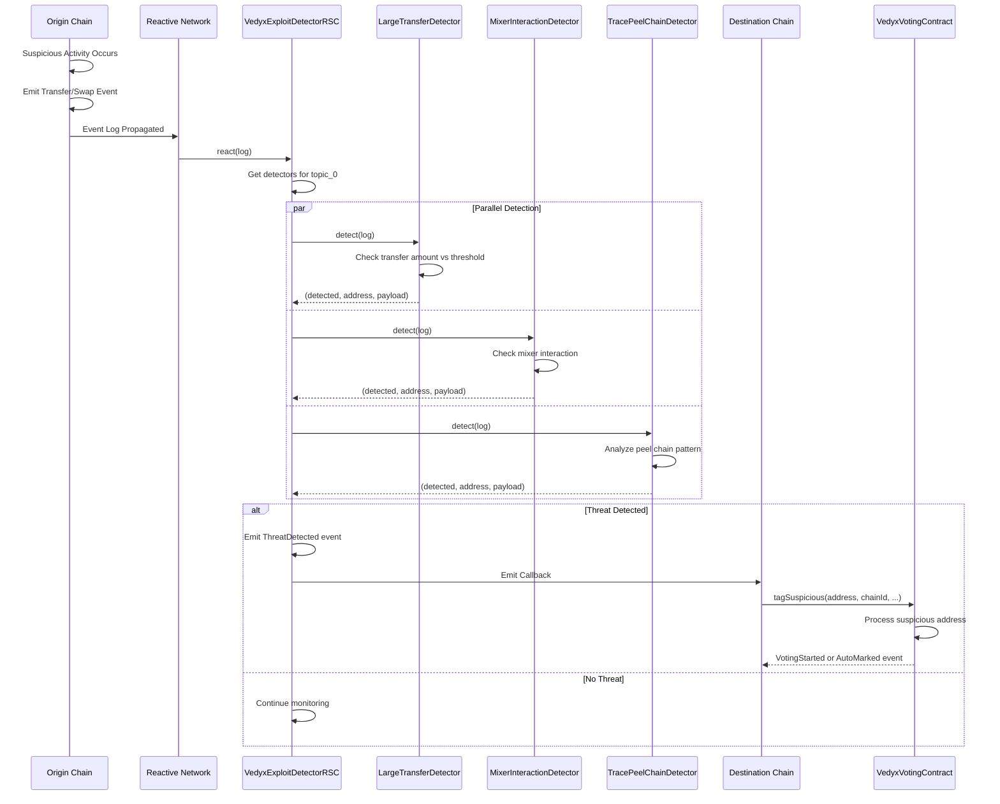

# Detection Flow - Reactive Network

## Key Points

### Singleton Pattern
- **Single Entry Point**: All events routed through VedyxExploitDetectorRSC
- **Topic-Based Routing**: Efficient filtering based on event signatures
- **Parallel Detection**: Multiple detectors analyze same event simultaneously

### Detector Independence
- **Stateless Detection**: Each detector makes independent decisions
- **Pluggable Architecture**: Add/remove detectors without redeploying singleton
- **Custom Logic**: Each detector implements specific attack pattern recognition

### Gas Optimization
- **Early Exit**: Stop processing if no detectors registered for topic
- **Minimal Callback**: Only essential data sent to destination chain
- **Batch Processing**: Multiple threats can be detected in single transaction
