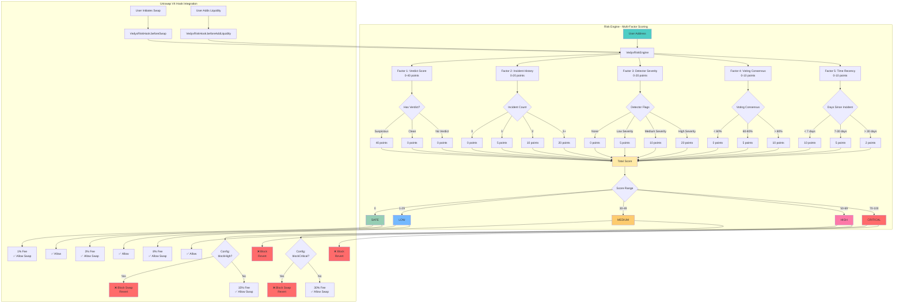
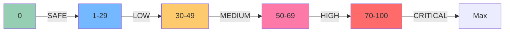

# Risk Assessment & DeFi Integration



## Risk Score Breakdown

### Factor Weights

| Factor | Weight | Description |
|--------|--------|-------------|
| **Verdict** | 0-40 | Community voting result (highest weight) |
| **Incidents** | 0-20 | Historical incident count |
| **Detectors** | 0-20 | Severity of detector flags |
| **Consensus** | 0-10 | Voting agreement strength |
| **Recency** | 0-10 | Time decay factor |

### Risk Level Thresholds



## Uniswap V4 Hook Response Matrix

### Swap Operations

| Risk Level | Score | Default Fee | Configurable Blocking |
|------------|-------|-------------|----------------------|
| SAFE       | 0     | 1%          | ❌ Never blocked     |
| LOW        | 1-29  | 3%          | ❌ Never blocked     |
| MEDIUM     | 30-49 | 8%          | ❌ Never blocked     |
| HIGH       | 50-69 | 15%         | ✅ Can be blocked    |
| CRITICAL   | 70+   | 30%         | ✅ Can be blocked    |

### Liquidity Operations

| Risk Level | Add Liquidity | Remove Liquidity |
|------------|---------------|------------------|
| SAFE       | ✅ Allowed    | ✅ Allowed       |
| LOW        | ✅ Allowed    | ✅ Allowed       |
| MEDIUM     | ✅ Allowed    | ✅ Allowed       |
| HIGH       | ❌ Blocked    | ❌ Blocked       |
| CRITICAL   | ❌ Blocked    | ❌ Blocked       |

## Configuration Options

### Hook Config (Owner-Controlled)

```solidity
struct HookConfig {
    bool dynamicFeesEnabled;    // Enable/disable dynamic fees
    bool blockHigh;             // Block HIGH risk swaps
    bool blockCritical;         // Block CRITICAL risk swaps
    uint24 minFee;              // Minimum fee (e.g., 1%)
    uint24 maxFee;              // Maximum fee (e.g., 30%)
}
```

### Fee Config (Owner-Controlled)

```solidity
struct FeeConfig {
    uint24 safeFee;       // 1% (0.01 * 1e6)
    uint24 lowFee;        // 3% (0.03 * 1e6)
    uint24 mediumFee;     // 8% (0.08 * 1e6)
    uint24 highFee;       // 15% (0.15 * 1e6)
    uint24 criticalFee;   // 30% (0.30 * 1e6)
}
```

## Example Scenarios

### Scenario 1: Clean User
- **Verdict**: None
- **Incidents**: 0
- **Detectors**: None
- **Score**: 0
- **Risk Level**: SAFE
- **Swap Fee**: 1%
- **Liquidity**: ✅ Allowed

### Scenario 2: Flagged Once
- **Verdict**: Suspicious
- **Incidents**: 1
- **Detectors**: Low severity
- **Consensus**: 65%
- **Recency**: 10 days
- **Score**: 40 + 5 + 5 + 5 + 5 = 60
- **Risk Level**: HIGH
- **Swap Fee**: 15% (or blocked if configured)
- **Liquidity**: ❌ Blocked

### Scenario 3: Repeat Offender
- **Verdict**: Suspicious
- **Incidents**: 3+
- **Detectors**: High severity
- **Consensus**: 85%
- **Recency**: 3 days
- **Score**: 40 + 20 + 20 + 10 + 10 = 100
- **Risk Level**: CRITICAL
- **Swap Fee**: 30% (or blocked if configured)
- **Liquidity**: ❌ Blocked
