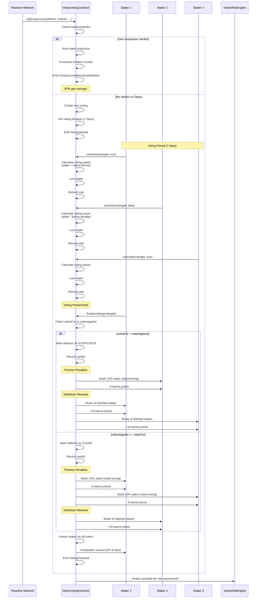
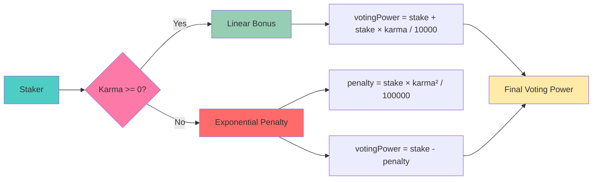
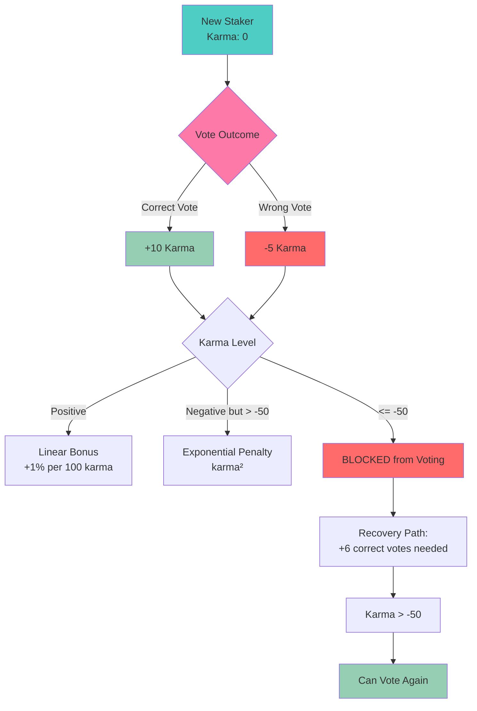

# Voting Flow - Community Validation

## Voting Power Calculation

## Karma System

## Key Features

### Auto-Classification
- **Repeat Offenders**: Instantly marked without voting (87% gas savings)
- **Fresh Evaluation**: Clean addresses can be re-judged with new evidence
- **Incident Tracking**: Total incidents never reset (permanent record)

### Economic Incentives
- **Stake Penalties**: 10% slash for incorrect votes (configurable, max 50%)
- **Reward Distribution**: Correct voters share penalty pool
- **Finalization Rewards**: 2% of collected fees to finalizer (configurable, max 10%)
- **Karma Impact**: Affects future voting power

### Security Features
- **Self-Voting Prevention**: Users cannot vote on their own addresses
- **Minimum Karma**: -50 karma threshold blocks voting
- **Locked Stakes**: Prevents manipulation during active voting
- **Reentrancy Protection**: All state-changing functions protected
