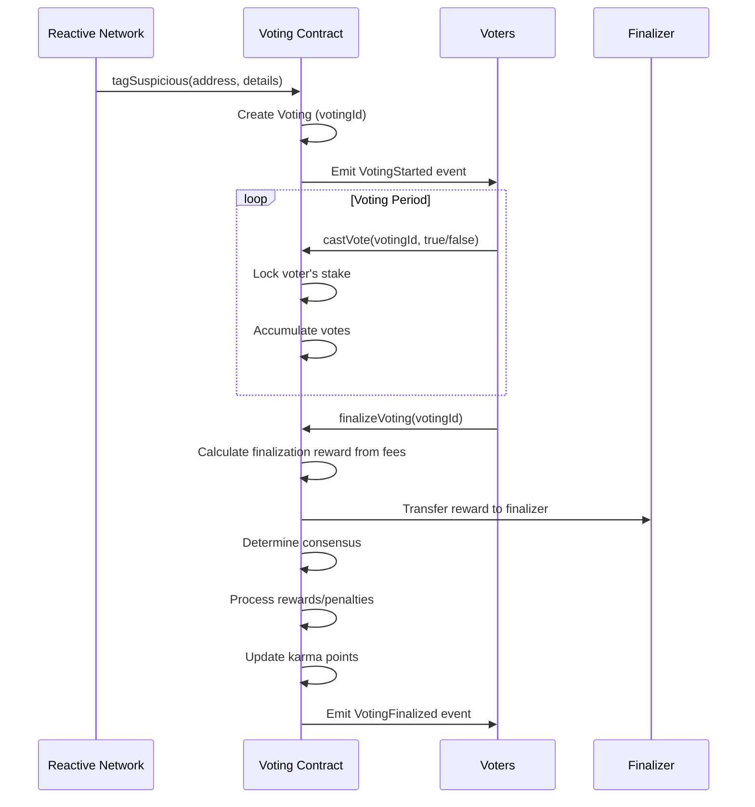

# Vedyx Voting Contract - Complete Guide

## Overview

The `VedyxVotingContract` is a decentralized governance system that enables community-driven validation of suspicious addresses detected by the Reactive Network. It implements a sophisticated stake-based voting mechanism with karma tracking and penalty systems.

## Key Features

### ✅ 1. Stake-Based Voting Power
- Users stake protocol tokens to participate in voting
- Voting power = Staked Amount + Karma Effect (can be positive or negative)
- **Positive karma**: Linear bonus - Each 100 karma points adds 1% to voting power
- **Negative karma**: Exponential penalty - penalty = stake × (karma²) / 100000
- Voting power can become negative if karma is very negative
- Minimum stake requirement configurable by owner

### ✅ 2. Reactive Network Integration
- `tagSuspicious()` callback function receives reports from Reactive Network
- Automatically initiates voting process for each suspicious address
- Tracks complete transaction details (chain ID, contract, value, tx hash)

### ✅ 3. Multi-Voting Management
- Supports multiple concurrent voting processes
- Each voting has unique ID and time-bound duration
- Tracks active votings and historical records per address

### ✅ 4. Enhanced Penalty System
- **Stake Penalties**: Voters who vote against consensus lose a percentage of their stake
  - Configurable penalty percentage (default: 10% = 1000 basis points)
  - Maximum penalty capped at 50% for safety
- **Karma Penalties**: Exponential impact on voting power
  - Formula: penalty = stake × (karma²) / 100000
  - Small mistakes have minimal impact (-5 karma ≈ 0.125 ETH on 500 ETH stake)
  - Repeated mistakes become exponentially more costly (-50 karma ≈ 12.5 ETH penalty)
- **Karma Threshold**: Hard lockout at -50 karma (Default: -50, Configurable)
  - Users below -50 karma cannot vote at all
  - Prevents chronic bad actors from participating
  - Requires sustained correct voting to recover

### ✅ 5. Advanced Karma Tracking System
- **Rewards**: Correct voters earn karma points (+10 default)
- **Penalties**: Incorrect voters lose karma points (-5 default)
- **Karma can go negative**: No lower bound, allowing severe penalties
- **Exponential Impact**: Negative karma has exponentially worse effect on voting power
- **Voting Threshold**: Users with karma < -50 (Configurable) are blocked from voting
- **Recovery Path**: Earn positive karma through correct votes to restore voting rights
- **Tracks Statistics**: Total votes, correct votes, and accuracy percentage

### ✅ 6. Finalization Reward System
- Users who finalize voting receive rewards from collected fees
- Configurable reward percentage (default: 2% of collected fees)
- Incentivizes timely finalization of voting processes
- Rewards come from finalization fees collected during vote finalization
- Maximum reward capped at 10% for safety

### ✅ 7. Fee Management System
- Finalization fee percentage configurable by owner (max 10%)
- Fees collected from penalties during vote finalization
- Fee is deducted from total penalties before distributing to correct voters
- Treasury system for fee collection and management
- Owner can transfer collected fees to treasury

## Architecture

```
┌─────────────────────────────────────────────────────────────┐
│                  Reactive Network                            │
│                                                              │
│  VedyxExploitDetectorRSC detects suspicious activity        │
│                    ↓                                         │
│              emit Callback()                                 │
└──────────────────────┬──────────────────────────────────────┘
                       ↓
┌─────────────────────────────────────────────────────────────┐
│              Destination Chain (e.g., Ethereum)              │
│                                                              │
│  ┌────────────────────────────────────────────────────┐    │
│  │         VedyxVotingContract                        │    │
│  │                                                     │    │
│  │  tagSuspicious() ← Callback from Reactive Network │    │
│  │         ↓                                          │    │
│  │  Start Voting Process (votingId)                  │    │
│  │         ↓                                          │    │
│  │  Community votes (stake-weighted)                 │    │
│  │         ↓                                          │    │
│  │  Finalize → Apply Penalties/Rewards               │    │
│  │         ↓                                          │    │
│  │  Update Karma & Slash Bad Voters                  │    │
│  └────────────────────────────────────────────────────┘    │
└─────────────────────────────────────────────────────────────┘
```

## Core Workflows

### Workflow 1: Staking Tokens

```solidity
// 1. Approve tokens
stakingToken.approve(votingContract, amount);

// 2. Stake tokens
votingContract.stake(amount);

// 3. Check voting power
uint256 power = votingContract.getVotingPower(msg.sender);
```

### Workflow 2: Voting Process



### Workflow 3: Penalty & Reward System

**Correct Voters (Voted with Consensus):**
- ✅ Receive karma points (+10 default)
- ✅ Receive proportional share of penalties from incorrect voters
- ✅ Stake unlocked
- ✅ Accuracy stats updated

**Incorrect Voters (Voted against Consensus):**
- ❌ Lose karma points (-5 default)
- ❌ Stake slashed (10% default, configurable)
- ❌ Slashed stake distributed to correct voters
- ❌ Voting power reduced exponentially with negative karma
- ❌ Blocked from voting if karma drops below -50
- ❌ Penalty recorded

**Finalizer (User who calls finalizeVoting):**
- 💰 Receives reward from collected fees (default: 2%, configurable)
- 💰 Reward amount = totalFeesCollected × finalizationRewardPercentage / 10000
- 💰 Incentivizes timely finalization of voting processes

## Smart Contract Interface

### Staking Functions

```solidity
// Stake tokens to gain voting power
function stake(uint256 amount) external

// Unstake tokens (only unlocked amount) without any fees
// Cannot unstake if you have locked amounts in active votes
function unstake(uint256 amount) external
```

**Note on Unstaking:**
- Unstaking is **free** - no fees charged
- User receives full unstaked amount
- Cannot unstake while having locked amounts in active votes

### Voting Functions

```solidity
// Cast a vote on suspicious address
function castVote(uint256 votingId, bool voteSuspicious) external

// Finalize voting after duration ends
// Collects fee from penalties before distributing to correct voters
// Caller receives a reward from collected fees for finalizing
function finalizeVoting(uint256 votingId) external
```

**Note on Finalization:**
- Anyone can call `finalizeVoting()` after the voting period ends
- **Fee Collection**: A fee is collected from penalties of incorrect voters
  - Fee = `(totalPenalties × finalizationFeePercentage) / 10000`
  - Default: configurable (max 10%)
  - Fee is deducted **before** distributing penalties to correct voters
  - Fees are added to `totalFeesCollected`
- **Penalty Distribution**: Remaining penalties after fee deduction are distributed to correct voters
  - Distribution = `totalPenalties - finalizationFee`
  - Split proportionally based on voting power of correct voters
- **Finalizer Reward**: The caller receives a reward from `totalFeesCollected`
  - Reward = `(totalFeesCollected × finalizationRewardPercentage) / 10000`
  - Default reward: 2% of collected fees
- This incentivizes timely finalization of voting processes

### Callback Function (Called by Reactive Network)

```solidity
function tagSuspicious(
    address suspiciousAddress,
    uint256 originChainId,
    address originContract,
    uint256 value,
    uint256 decimals,
    uint256 txHash
) external returns (uint256 votingId)
```

### View Functions

```solidity
// Get voting details
function getVotingDetails(uint256 votingId) external view returns (...)

// Get voter's vote
function getVote(uint256 votingId, address voter) external view returns (...)

// Get staker information
function getStakerInfo(address staker) external view returns (...)

// Get active votings
function getActiveVotings() external view returns (uint256[] memory)

// Get voting history for address
function getAddressVotingHistory(address addr) external view returns (uint256[] memory)

// Get voter's voting power (can be negative)
function getVotingPower(address voter) external view returns (int256)

// Get voter's accuracy rate
function getVoterAccuracy(address voter) external view returns (uint256)

// Get all voters for a voting
function getVoters(uint256 votingId) external view returns (address[] memory)
```

### Admin Functions

```solidity
// Update callback authorizer
function setCallbackAuthorizer(address newAuthorizer) external onlyOwner

// Update minimum stake
function setMinimumStake(uint256 newMinimum) external onlyOwner

// Update voting duration
function setVotingDuration(uint256 newDuration) external onlyOwner

// Update penalty percentage
function setPenaltyPercentage(uint256 newPercentage) external onlyOwner

// Update karma rewards/penalties
function setKarmaReward(uint256 newReward) external onlyOwner
function setKarmaPenalty(uint256 newPenalty) external onlyOwner

// Update minimum karma threshold for voting
function setMinimumKarmaToVote(int256 newMinimumKarma) external onlyOwner

// Update finalization reward percentage (max 10%)
function setFinalizationRewardPercentage(uint256 newPercentage) external onlyOwner

// Update treasury address
function setTreasury(address newTreasury) external onlyOwner

// Update finalization fee percentage (max 10%)
function setFinalizationFeePercentage(uint256 newFeePercentage) external onlyOwner

// Transfer collected fees to treasury
function transferFeesToTreasury(uint256 amount) external onlyOwner
```

## Data Structures

### SuspiciousReport
```solidity
struct SuspiciousReport {
    address suspiciousAddress;
    uint256 originChainId;
    address originContract;
    uint256 value;
    uint256 decimals;
    uint256 txHash;
    bytes32 detectorId;
}
```

### Voting
```solidity
struct Voting {
    uint256 votingId;
    SuspiciousReport report;
    uint256 startTime;
    uint256 endTime;
    uint256 votesFor;      // Votes confirming suspicious
    uint256 votesAgainst;  // Votes denying suspicious
    uint256 totalVotingPower;
    bool finalized;
    bool isSuspicious;     // Final verdict
    mapping(address => Vote) votes;
    address[] voters;
}
```

### Staker
```solidity
struct Staker {
    uint256 stakedAmount;
    int256 karmaPoints;    // Can be negative
    uint256 totalVotes;
    uint256 correctVotes;
    uint256 lockedAmount;  // Amount locked in active votes
}
```

## Deployment Guide

### Constructor Parameters

```solidity
constructor(
    address _stakingToken,        // Protocol token address
    address _callbackAuthorizer,  // Reactive Network bridge address
    uint256 _minimumStake,              // e.g., 100e18 (100 tokens)
    uint256 _votingDuration,            // e.g., 86400 (24 hours)
    uint256 _penaltyPercentage,         // e.g., 1000 (10%)
    address _treasury,                  // Treasury address
    uint256 _finalizationFeePercentage  // e.g., 100 (1%)
)
```

### Example Deployment Script

```solidity
// Deploy voting contract
VedyxVotingContract voting = new VedyxVotingContract(
    VEDYX_TOKEN_ADDRESS,
    REACTIVE_BRIDGE_ADDRESS,
    100e18,      // 100 tokens minimum
    86400,       // 24 hours voting period
    1000,        // 10% penalty
    TREASURY_ADDRESS,
    100          // 1% finalization fee
);

// Configure karma settings
voting.setKarmaReward(10);
voting.setKarmaPenalty(5);
```

## Integration with Reactive Network

### Step 1: Update VedyxExploitDetectorRSC

Update the callback payload in the detector to call `tagSuspicious`:

```solidity
bytes memory payload = abi.encodeWithSignature(
    "tagSuspicious(address,uint256,address,uint256,uint256,uint256)",
    suspect,
    originChainId,
    originContract,
    value,
    decimals,
    txHash
);
```

### Step 2: Set Callback Contract

```solidity
vedyxDetector.setCallback(address(votingContract));
```

### Step 3: Authorize Callback

```solidity
votingContract.setCallbackAuthorizer(REACTIVE_BRIDGE_ADDRESS);
```

## Usage Examples

### Example 1: Becoming a Voter

```solidity
// 1. Get protocol tokens
IERC20 vedyxToken = IERC20(VEDYX_TOKEN_ADDRESS);

// 2. Approve voting contract
vedyxToken.approve(address(votingContract), 1000e18);

// 3. Stake tokens
votingContract.stake(1000e18);

// 4. Check your voting power
uint256 power = votingContract.getVotingPower(msg.sender);
console.log("Your voting power:", power);
```

### Example 2: Participating in a Vote

```solidity
// 1. Check active votings
uint256[] memory activeVotes = votingContract.getActiveVotings();

// 2. Get voting details
(
    SuspiciousReport memory report,
    uint256 startTime,
    uint256 endTime,
    uint256 votesFor,
    uint256 votesAgainst,
    bool finalized,
    bool isSuspicious
) = votingContract.getVotingDetails(activeVotes[0]);

// 3. Cast your vote
bool voteSuspicious = true; // or false
votingContract.castVote(activeVotes[0], voteSuspicious);
```

### Example 3: Finalizing a Vote and Earning Rewards

```solidity
// Anyone can finalize after voting period ends and earn a reward
uint256 votingId = 1;

// Check if voting period has ended
(, , uint256 endTime, , , bool finalized, ) = 
    votingContract.getVotingDetails(votingId);

if (block.timestamp >= endTime && !finalized) {
    // Finalize and receive reward from collected fees
    votingContract.finalizeVoting(votingId);
    // Caller receives: (totalFeesCollected * finalizationRewardPercentage) / 10000
    // Default: 2% of collected fees
}
```

### Example 4: Calculating Potential Finalization Reward

```solidity
// Check potential reward before finalizing
uint256 totalFees = votingContract.totalFeesCollected();
uint256 rewardPercentage = votingContract.finalizationRewardPercentage();

// Calculate expected reward
uint256 expectedReward = (totalFees * rewardPercentage) / 10000;
console.log("Expected finalization reward:", expectedReward);

// If reward is attractive, finalize the voting
if (expectedReward > minDesiredReward) {
    votingContract.finalizeVoting(votingId);
}
```

### Example 5: Monitoring Your Stats

```solidity
// Get your staker info
(
    uint256 stakedAmount,
    uint256 karmaPoints,
    uint256 totalVotes,
    uint256 correctVotes,
    uint256 lockedAmount
) = votingContract.getStakerInfo(msg.sender);

// Calculate accuracy
uint256 accuracy = votingContract.getVoterAccuracy(msg.sender);
console.log("Your accuracy:", accuracy / 100, "%");
```

## Security Considerations

### 1. Reentrancy Protection
- All state-changing functions use `nonReentrant` modifier
- Follows checks-effects-interactions pattern

### 2. Access Control
- Only authorized callback address can trigger `tagSuspicious()`
- Owner-only functions for parameter updates
- Maximum penalty cap (50%) to prevent excessive slashing
- Karma threshold prevents users with karma < -50(Configurable) from voting

### 3. Stake Locking
- Stakes are locked during active votes
- Prevents vote manipulation through stake withdrawal
- Automatic unlocking after voting finalization

### 4. Integer Overflow Protection
- Solidity 0.8.28 has built-in overflow checks
- Safe math operations throughout

### 5. Input Validation
- Zero address checks
- Amount validation
- Voting ID existence checks

## Events

```solidity
event Staked(address indexed staker, uint256 amount);
event Unstaked(address indexed staker, uint256 amount, uint256 fee);
event FeeCollected(address indexed staker, uint256 feeAmount);
event VotingStarted(uint256 indexed votingId, address indexed suspiciousAddress, uint256 endTime);
event VoteCast(uint256 indexed votingId, address indexed voter, bool votedFor, uint256 votingPower);
event VotingFinalized(uint256 indexed votingId, address indexed suspiciousAddress, bool isSuspicious, uint256 votesFor, uint256 votesAgainst);
event PenaltyApplied(address indexed voter, uint256 indexed votingId, uint256 penaltyAmount);
event KarmaUpdated(address indexed voter, int256 karmaChange, int256 newKarma);
event VoterRewarded(address indexed voter, uint256 indexed votingId, uint256 rewardAmount);
event FinalizationRewardPaid(uint256 indexed votingId, address indexed finalizer, uint256 rewardAmount);
event FinalizationRewardPercentageUpdated(uint256 newPercentage);
event MinimumKarmaToVoteUpdated(int256 newMinimumKarma);
event TreasuryUpdated(address indexed newTreasury);
event FinalizationFeeUpdated(uint256 newFeePercentage);
```

## Gas Optimization Tips

1. **Batch Operations**: Finalize multiple votings in a single transaction if possible
2. **Off-chain Monitoring**: Use events to track voting status off-chain
3. **Efficient Queries**: Use view functions to check state before transactions
4. **Karma Calculation**: Cached in voting power calculation for efficiency

## Testing Checklist

- [ ] Stake tokens successfully
- [ ] Unstake only unlocked amounts
- [ ] Callback creates voting process
- [ ] Cast vote with sufficient stake
- [ ] Prevent double voting
- [ ] Finalize voting after duration
- [ ] Correct voters receive karma
- [ ] Incorrect voters get penalized
- [ ] Voting power calculation includes karma
- [ ] Multiple concurrent votings work
- [ ] Access control enforced
- [ ] Reentrancy protection works

## Penalty System Details

### Karma Penalty Progression

With a 500 ETH stake, here's how negative karma affects voting power:

| Karma | Penalty Calculation | Voting Power | Status |
|-------|-------------------|--------------|--------|
| 0 | No penalty | 500 ETH | ✅ Full power |
| -5 | 500 × (5²) / 100000 = 0.125 ETH | 499.875 ETH | ✅ Minimal impact |
| -10 | 500 × (10²) / 100000 = 0.5 ETH | 499.5 ETH | ✅ Slight reduction |
| -25 | 500 × (25²) / 100000 = 3.125 ETH | 496.875 ETH | ⚠️ Noticeable |
| -50 | 500 × (50²) / 100000 = 12.5 ETH | 487.5 ETH | ⚠️ Significant |
| -55 | N/A | N/A | ❌ **BLOCKED** (below threshold) |
| -100 | Would be 50 ETH | Would be 450 ETH | ❌ Blocked at threshold |

### Key Thresholds

- **Minimum Karma to Vote**: -50 (Configurable)
- **Votes to Reach Threshold**: 11 incorrect votes (at -5 penalty each)
- **Recovery Required**: 6 correct votes (+10 each) to recover from -50

### Exponential Penalty Formula

```solidity
if (karmaPoints < 0) {
    uint256 absKarma = uint256(-karmaPoints);
    uint256 squaredKarma = absKarma * absKarma;
    uint256 penaltyAmount = stake.mulDivDown(squaredKarma, 100000);
    votingPower = stake - penaltyAmount;
}
```

### Benefits of Dual System

1. **Progressive Deterrence**: Small mistakes have minimal impact, repeated mistakes become exponentially costly
2. **Hard Lockout**: Chronic bad actors are completely blocked after 11 incorrect votes
3. **Recovery Path**: Users can recover through sustained correct voting
4. **No Exploitation**: Can't game the system by voting to recover when blocked

## Future Enhancements

1. **Delegation**: Allow users to delegate voting power
2. **Quorum Requirements**: Minimum participation threshold
3. **Time-weighted Voting**: Earlier votes have more weight
4. **Appeal Mechanism**: Allow addresses to appeal decisions
5. **Reputation NFTs**: Mint NFTs for high-karma voters
6. **Governance**: Community voting on parameter changes
7. **Dynamic Karma Threshold**: Adjust threshold based on network conditions

## Support & Documentation

For more information:
- Main README: `../README.md`
- Reactive Contracts: `./src/reactive-contracts/README.md`
- Contract Source: `./src/VedyxVotingContract.sol`
