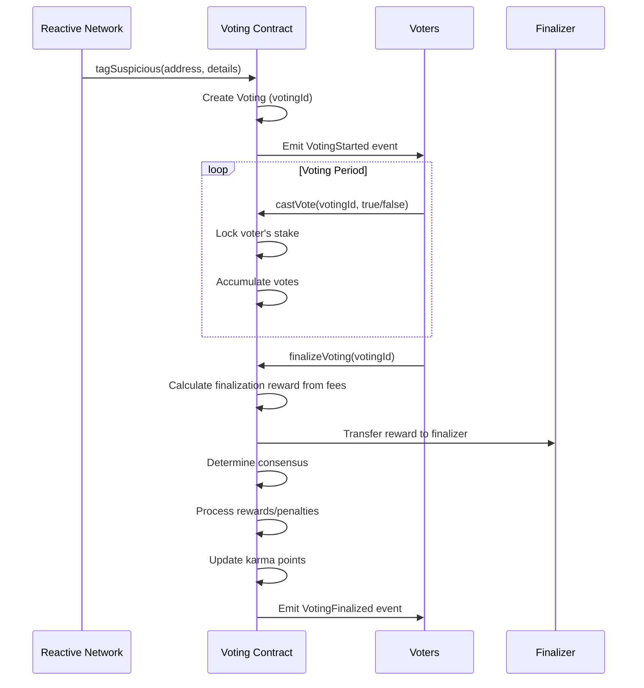

# Vedyx Voting Contract - Complete Guide

## Overview

The `VedyxVotingContract` is a decentralized governance system that enables community-driven validation of suspicious addresses detected by the Reactive Network. It implements a sophisticated stake-based voting mechanism with karma tracking and penalty systems.

## Modular Architecture

The voting contract is built with a modular architecture for maintainability and gas efficiency:

```
src/voting-contract/
├── VedyxVotingContract.sol          # Main contract
├── interfaces/
│   └── IVedyxVoting.sol             # Contract interface
└── libraries/
    ├── VedyxErrors.sol              # Custom errors
    ├── VedyxTypes.sol               # Data structures
    ├── VotingPowerLib.sol           # Voting power calculations
    └── VotingResultsLib.sol         # Results processing
```

**See [voting-contract/README.md](./voting-contract/README.md) for detailed architecture documentation.**

## Key Features

### ✅ 1. Stake-Based Voting Power
- Users stake protocol tokens to participate in voting
- Voting power = Staked Amount + Karma Effect (can be positive or negative)
- **Positive karma**: Linear bonus - Each 100 karma points adds 1% to voting power
- **Negative karma**: Exponential penalty - penalty = stake × (karma²) / 100000
- Voting power can become negative if karma is very negative
- Minimum stake requirement configurable by owner

### ✅ 2. Reactive Network Integration
- `tagSuspicious()` callback function receives reports from Reactive Network
- Automatically initiates voting process for each suspicious address
- Tracks complete transaction details (chain ID, contract, value, tx hash)

### ✅ 3. Multi-Voting Management
- Supports multiple concurrent voting processes
- Each voting has unique ID and time-bound duration
- Tracks active votings and historical records per address

### ✅ 4. Enhanced Penalty System
- **Stake Penalties**: Voters who vote against consensus lose a percentage of their stake
  - Configurable penalty percentage (default: 10% = 1000 basis points)
  - Maximum penalty capped at 50% for safety
- **Karma Penalties**: Exponential impact on voting power
  - Formula: penalty = stake × (karma²) / 100000
  - Small mistakes have minimal impact (-5 karma ≈ 0.125 ETH on 500 ETH stake)
  - Repeated mistakes become exponentially more costly (-50 karma ≈ 12.5 ETH penalty)
- **Karma Threshold**: Hard lockout at -50 karma (Default: -50, Configurable)
  - Users below -50 karma cannot vote at all
  - Prevents chronic bad actors from participating
  - Requires sustained correct voting to recover

### ✅ 5. Advanced Karma Tracking System
- **Rewards**: Correct voters earn karma points (+10 default)
- **Penalties**: Incorrect voters lose karma points (-5 default)
- **Karma can go negative**: No lower bound, allowing severe penalties
- **Exponential Impact**: Negative karma has exponentially worse effect on voting power
- **Voting Threshold**: Users with karma < -50 (Configurable) are blocked from voting
- **Recovery Path**: Earn positive karma through correct votes to restore voting rights
- **Tracks Statistics**: Total votes, correct votes, and accuracy percentage

### ✅ 6. Finalization Reward System
- Users who finalize voting receive rewards from collected fees
- Configurable reward percentage (default: 2% of collected fees)
- Incentivizes timely finalization of voting processes
- Rewards come from finalization fees collected during vote finalization
- Maximum reward capped at 10% for safety

### ✅ 7. Fee Management System
- Finalization fee percentage configurable by treasury role (max 10%)
- Fees collected from penalties during vote finalization
- Fee is deducted from total penalties before distributing to correct voters
- Treasury system for fee collection and management
- Treasury role can transfer collected fees to treasury

### ✅ 8. Role-Based Access Control (RBAC)
- **OpenZeppelin AccessControl** integration for granular permission management
- **Three specialized roles** for different operational responsibilities:
  - `GOVERNANCE_ROLE`: Critical protocol parameters and security settings
  - `PARAMETER_ADMIN_ROLE`: Day-to-day operational parameter tuning
  - `TREASURY_ROLE`: Financial operations and fee management
- **DEFAULT_ADMIN_ROLE**: Meta-role for managing other roles (grant/revoke)
- **Flexible deployment**: All roles initially granted to deployer
- **Progressive decentralization**: Roles can be transferred to DAOs, multi-sigs, or specialized teams
- **Role separation**: Each role has isolated permissions, preventing single point of failure
- **Backward compatible**: Owner retains all permissions initially

### ✅ 9. Verdict-Based Auto-Classification System
- **Intelligent repeat offender handling**: Addresses with confirmed suspicious verdicts are auto-marked on subsequent incidents
- **No redundant voting**: Prevents voter fatigue by skipping votes for known bad actors
- **Pattern-based classification**: One vote covers a pattern of behavior for an address
- **Cross-chain consistency**: Verdicts are permanent and apply across all chains (same address = same user)
- **Re-evaluation for clean addresses**: Addresses previously voted clean can be re-evaluated with new evidence
- **Governance override**: False positive verdicts can be cleared by governance role
- **Audit trail**: Incident count preserved even after verdict clearing for transparency
- **Self-voting prevention**: Users cannot vote on their own address to prevent conflicts of interest
- **Gas optimized**: Efficient verdict lookups with minimal storage reads

## Architecture

```
┌─────────────────────────────────────────────────────────────┐
│                  Reactive Network                            │
│                                                              │
│  VedyxExploitDetectorRSC detects suspicious activity        │
│                    ↓                                         │
│              emit Callback()                                 │
└──────────────────────┬──────────────────────────────────────┘
                       ↓
┌─────────────────────────────────────────────────────────────┐
│              Destination Chain (e.g., Ethereum)              │
│                                                              │
│  ┌────────────────────────────────────────────────────┐    │
│  │         VedyxVotingContract                        │    │
│  │                                                     │    │
│  │  tagSuspicious() ← Callback from Reactive Network │    │
│  │         ↓                                          │    │
│  │  Check Verdict History                            │    │
│  │    ├─ Previous Suspicious → Auto-Mark (skip vote) │    │
│  │    └─ No/Clean Verdict → Start Voting (votingId)  │    │
│  │         ↓                                          │    │
│  │  Community votes (stake-weighted)                 │    │
│  │         ↓                                          │    │
│  │  Finalize → Record Verdict                        │    │
│  │         ↓                                          │    │
│  │  Apply Penalties/Rewards & Update Karma           │    │
│  └────────────────────────────────────────────────────┘    │
└─────────────────────────────────────────────────────────────┘
```

## Core Workflows

### Workflow 1: Staking Tokens

```solidity
// 1. Approve tokens
stakingToken.approve(votingContract, amount);

// 2. Stake tokens
votingContract.stake(amount);

// 3. Check voting power
uint256 power = votingContract.getVotingPower(msg.sender);
```

### Workflow 2: Voting Process



### Workflow 3: Penalty & Reward System

**Correct Voters (Voted with Consensus):**
- ✅ Receive karma points (+10 default)
- ✅ Receive proportional share of penalties from incorrect voters
- ✅ Stake unlocked
- ✅ Accuracy stats updated

**Incorrect Voters (Voted against Consensus):**
- ❌ Lose karma points (-5 default)
- ❌ Stake slashed (10% default, configurable)
- ❌ Slashed stake distributed to correct voters
- ❌ Voting power reduced exponentially with negative karma
- ❌ Blocked from voting if karma drops below -50
- ❌ Penalty recorded

**Finalizer (User who calls finalizeVoting):**
- 💰 Receives reward from collected fees (default: 2%, configurable)
- 💰 Reward amount = totalFeesCollected × finalizationRewardPercentage / 10000
- 💰 Incentivizes timely finalization of voting processes

## Smart Contract Interface

### Staking Functions

```solidity
// Stake tokens to gain voting power
function stake(uint256 amount) external

// Unstake tokens (only unlocked amount) without any fees
// Cannot unstake if you have locked amounts in active votes
function unstake(uint256 amount) external
```

**Note on Unstaking:**
- Unstaking is **free** - no fees charged
- User receives full unstaked amount
- Cannot unstake while having locked amounts in active votes

### Voting Functions

```solidity
// Cast a vote on suspicious address
function castVote(uint256 votingId, bool voteSuspicious) external

// Finalize voting after duration ends
// Collects fee from penalties before distributing to correct voters
// Caller receives a reward from collected fees for finalizing
function finalizeVoting(uint256 votingId) external
```

**Note on Finalization:**
- Anyone can call `finalizeVoting()` after the voting period ends
- **Fee Collection**: A fee is collected from penalties of incorrect voters
  - Fee = `(totalPenalties × finalizationFeePercentage) / 10000`
  - Default: configurable (max 10%)
  - Fee is deducted **before** distributing penalties to correct voters
  - Fees are added to `totalFeesCollected`
- **Penalty Distribution**: Remaining penalties after fee deduction are distributed to correct voters
  - Distribution = `totalPenalties - finalizationFee`
  - Split proportionally based on voting power of correct voters
- **Finalizer Reward**: The caller receives a reward from `totalFeesCollected`
  - Reward = `(totalFeesCollected × finalizationRewardPercentage) / 10000`
  - Default reward: 2% of collected fees
- This incentivizes timely finalization of voting processes

### Callback Function (Called by Reactive Network)

```solidity
function tagSuspicious(
    address suspiciousAddress,
    uint256 originChainId,
    address originContract,
    uint256 value,
    uint256 decimals,
    uint256 txHash
) external returns (uint256 votingId)
```

### View Functions

```solidity
// Get voting details
function getVotingDetails(uint256 votingId) external view returns (...)

// Get voter's vote
function getVote(uint256 votingId, address voter) external view returns (...)

// Get staker information
function getStakerInfo(address staker) external view returns (...)

// Get active votings
function getActiveVotings() external view returns (uint256[] memory)

// Get voting history for address
function getAddressVotingHistory(address addr) external view returns (uint256[] memory)

// Get voter's voting power (can be negative)
function getVotingPower(address voter) external view returns (int256)

// Get voter's accuracy rate
function getVoterAccuracy(address voter) external view returns (uint256)

// Get all voters for a voting
function getVoters(uint256 votingId) external view returns (address[] memory)
```

### Admin Functions

#### GOVERNANCE_ROLE Functions (Critical Protocol Parameters)

```solidity
// Update callback authorizer (Reactive Network bridge)
function setCallbackAuthorizer(address newAuthorizer) external onlyRole(GOVERNANCE_ROLE)

// Update minimum stake requirement
function setMinimumStake(uint256 newMinimum) external onlyRole(GOVERNANCE_ROLE)

// Update voting duration
function setVotingDuration(uint256 newDuration) external onlyRole(GOVERNANCE_ROLE)

// Update penalty percentage for incorrect voters
function setPenaltyPercentage(uint256 newPercentage) external onlyRole(GOVERNANCE_ROLE)

// Update minimum karma threshold for voting eligibility
function setMinimumKarmaToVote(int256 newMinimumKarma) external onlyRole(GOVERNANCE_ROLE)
```

#### PARAMETER_ADMIN_ROLE Functions (Operational Tuning)

```solidity
// Update karma reward for correct votes
function setKarmaReward(uint256 newReward) external onlyRole(PARAMETER_ADMIN_ROLE)

// Update karma penalty for incorrect votes
function setKarmaPenalty(uint256 newPenalty) external onlyRole(PARAMETER_ADMIN_ROLE)

// Update finalization reward percentage (max 10%)
function setFinalizationRewardPercentage(uint256 newPercentage) external onlyRole(PARAMETER_ADMIN_ROLE)
```

#### TREASURY_ROLE Functions (Financial Management)

```solidity
// Update treasury address
function setTreasury(address newTreasury) external onlyRole(TREASURY_ROLE)

// Update finalization fee percentage (max 10%)
function setFinalizationFeePercentage(uint256 newFeePercentage) external onlyRole(TREASURY_ROLE)

// Transfer collected fees to treasury
function transferFeesToTreasury(uint256 amount) external onlyRole(TREASURY_ROLE)
```

#### Role Management Functions (DEFAULT_ADMIN_ROLE)

```solidity
// Grant a role to an address
function grantRole(bytes32 role, address account) external onlyRole(DEFAULT_ADMIN_ROLE)

// Revoke a role from an address
function revokeRole(bytes32 role, address account) external onlyRole(DEFAULT_ADMIN_ROLE)

// Renounce a role (self-revoke)
function renounceRole(bytes32 role, address account) external

// Check if an address has a specific role
function hasRole(bytes32 role, address account) external view returns (bool)
```

## Data Structures

### SuspiciousReport
```solidity
struct SuspiciousReport {
    address suspiciousAddress;
    uint256 originChainId;
    address originContract;
    uint256 value;
    uint256 decimals;
    uint256 txHash;
    bytes32 detectorId;
}
```

### Voting
```solidity
struct Voting {
    uint256 votingId;
    SuspiciousReport report;
    uint256 startTime;
    uint256 endTime;
    uint256 votesFor;      // Votes confirming suspicious
    uint256 votesAgainst;  // Votes denying suspicious
    uint256 totalVotingPower;
    bool finalized;
    bool isSuspicious;     // Final verdict
    mapping(address => Vote) votes;
    address[] voters;
}
```

### Staker
```solidity
struct Staker {
    uint256 stakedAmount;
    int256 karmaPoints;    // Can be negative
    uint256 totalVotes;
    uint256 correctVotes;
    uint256 lockedAmount;  // Amount locked in active votes
}
```

## Deployment Guide

### Constructor Parameters

```solidity
constructor(
    address _stakingToken,        // Protocol token address
    address _callbackAuthorizer,  // Reactive Network bridge address
    uint256 _minimumStake,              // e.g., 100e18 (100 tokens)
    uint256 _votingDuration,            // e.g., 86400 (24 hours)
    uint256 _penaltyPercentage,         // e.g., 1000 (10%)
    address _treasury,                  // Treasury address
    uint256 _finalizationFeePercentage  // e.g., 100 (1%)
)
```

### Example Deployment Script

```solidity
// Deploy voting contract
VedyxVotingContract voting = new VedyxVotingContract(
    VEDYX_TOKEN_ADDRESS,
    REACTIVE_BRIDGE_ADDRESS,
    100e18,      // 100 tokens minimum
    86400,       // 24 hours voting period
    1000,        // 10% penalty
    TREASURY_ADDRESS,
    100          // 1% finalization fee
);

// Configure karma settings
voting.setKarmaReward(10);
voting.setKarmaPenalty(5);
```

## Integration with Reactive Network

### Step 1: Update VedyxExploitDetectorRSC

Update the callback payload in the detector to call `tagSuspicious`:

```solidity
bytes memory payload = abi.encodeWithSignature(
    "tagSuspicious(address,uint256,address,uint256,uint256,uint256)",
    suspect,
    originChainId,
    originContract,
    value,
    decimals,
    txHash
);
```

### Step 2: Set Callback Contract

```solidity
vedyxDetector.setCallback(address(votingContract));
```

### Step 3: Authorize Callback

```solidity
votingContract.setCallbackAuthorizer(REACTIVE_BRIDGE_ADDRESS);
```

## Usage Examples

### Example 1: Becoming a Voter

```solidity
// 1. Get protocol tokens
IERC20 vedyxToken = IERC20(VEDYX_TOKEN_ADDRESS);

// 2. Approve voting contract
vedyxToken.approve(address(votingContract), 1000e18);

// 3. Stake tokens
votingContract.stake(1000e18);

// 4. Check your voting power
uint256 power = votingContract.getVotingPower(msg.sender);
console.log("Your voting power:", power);
```

### Example 2: Participating in a Vote

```solidity
// 1. Check active votings
uint256[] memory activeVotes = votingContract.getActiveVotings();

// 2. Get voting details
(
    SuspiciousReport memory report,
    uint256 startTime,
    uint256 endTime,
    uint256 votesFor,
    uint256 votesAgainst,
    bool finalized,
    bool isSuspicious
) = votingContract.getVotingDetails(activeVotes[0]);

// 3. Cast your vote
bool voteSuspicious = true; // or false
votingContract.castVote(activeVotes[0], voteSuspicious);
```

### Example 3: Finalizing a Vote and Earning Rewards

```solidity
// Anyone can finalize after voting period ends and earn a reward
uint256 votingId = 1;

// Check if voting period has ended
(, , uint256 endTime, , , bool finalized, ) = 
    votingContract.getVotingDetails(votingId);

if (block.timestamp >= endTime && !finalized) {
    // Finalize and receive reward from collected fees
    votingContract.finalizeVoting(votingId);
    // Caller receives: (totalFeesCollected * finalizationRewardPercentage) / 10000
    // Default: 2% of collected fees
}
```

### Example 4: Calculating Potential Finalization Reward

```solidity
// Check potential reward before finalizing
uint256 totalFees = votingContract.totalFeesCollected();
uint256 rewardPercentage = votingContract.finalizationRewardPercentage();

// Calculate expected reward
uint256 expectedReward = (totalFees * rewardPercentage) / 10000;
console.log("Expected finalization reward:", expectedReward);

// If reward is attractive, finalize the voting
if (expectedReward > minDesiredReward) {
    votingContract.finalizeVoting(votingId);
}
```

### Example 5: Monitoring Your Stats

```solidity
// Get your staker info
(
    uint256 stakedAmount,
    uint256 karmaPoints,
    uint256 totalVotes,
    uint256 correctVotes,
    uint256 lockedAmount
) = votingContract.getStakerInfo(msg.sender);

// Calculate accuracy
uint256 accuracy = votingContract.getVoterAccuracy(msg.sender);
console.log("Your accuracy:", accuracy / 100, "%");
```

## Security Considerations

### 1. Reentrancy Protection
- All state-changing functions use `nonReentrant` modifier
- Follows checks-effects-interactions pattern

### 2. Access Control
- Only authorized callback address can trigger `tagSuspicious()`
- **Role-based access control** using OpenZeppelin AccessControl
  - GOVERNANCE_ROLE for critical protocol parameters
  - PARAMETER_ADMIN_ROLE for operational tuning
  - TREASURY_ROLE for financial management
  - DEFAULT_ADMIN_ROLE for role administration
- Role separation prevents single point of failure
- Maximum penalty cap (50%) to prevent excessive slashing
- Karma threshold prevents users with karma < -50(Configurable) from voting

### 3. Stake Locking
- Stakes are locked during active votes
- Prevents vote manipulation through stake withdrawal
- Automatic unlocking after voting finalization

### 4. Integer Overflow Protection
- Solidity 0.8.28 has built-in overflow checks
- Safe math operations throughout

### 5. Input Validation
- Zero address checks
- Amount validation
- Voting ID existence checks

## Role-Based Access Control (RBAC)

### Overview

The VedyxVotingContract implements OpenZeppelin's AccessControl for granular permission management. This allows for:
- **Separation of concerns** across different operational areas
- **Progressive decentralization** by transferring roles to DAOs or multi-sigs
- **Reduced attack surface** - compromised key only affects one role
- **Flexible governance** models

### Role Definitions

#### 1. GOVERNANCE_ROLE
**Purpose**: Critical protocol parameters and security settings

**Permissions**:
- `setCallbackAuthorizer()` - Update Reactive Network bridge address
- `setMinimumStake()` - Update minimum stake requirement
- `setVotingDuration()` - Update voting period duration
- `setPenaltyPercentage()` - Update penalty for incorrect voters
- `setMinimumKarmaToVote()` - Update karma threshold for voting eligibility

**Recommended Holder**: DAO multi-sig or governance contract

**Rationale**: These parameters affect protocol security and economics. Changes should require community consensus or multi-sig approval.

#### 2. PARAMETER_ADMIN_ROLE
**Purpose**: Day-to-day operational parameter tuning

**Permissions**:
- `setKarmaReward()` - Update karma reward for correct votes
- `setKarmaPenalty()` - Update karma penalty for incorrect votes
- `setFinalizationRewardPercentage()` - Update finalizer reward percentage

**Recommended Holder**: Operations team or parameter optimization multi-sig

**Rationale**: These parameters may need frequent adjustment based on protocol performance and don't affect core security.

#### 3. TREASURY_ROLE
**Purpose**: Financial operations and fee management

**Permissions**:
- `setTreasury()` - Update treasury address
- `setFinalizationFeePercentage()` - Update finalization fee percentage
- `transferFeesToTreasury()` - Execute fee transfers to treasury

**Recommended Holder**: Treasury multi-sig or financial operations team

**Rationale**: Separates financial operations from governance and parameters. Allows dedicated treasury management.

#### 4. DEFAULT_ADMIN_ROLE
**Purpose**: Meta-role for managing other roles

**Permissions**:
- `grantRole()` - Grant roles to addresses
- `revokeRole()` - Revoke roles from addresses
- Admin over all other roles

**Recommended Holder**: Timelock contract or highest-level governance multi-sig

**Rationale**: Controls who can manage roles. Should be the most secured role.

### Role Constants

```solidity
bytes32 public constant GOVERNANCE_ROLE = keccak256("GOVERNANCE_ROLE");
bytes32 public constant PARAMETER_ADMIN_ROLE = keccak256("PARAMETER_ADMIN_ROLE");
bytes32 public constant TREASURY_ROLE = keccak256("TREASURY_ROLE");
bytes32 public constant DEFAULT_ADMIN_ROLE = 0x00; // OpenZeppelin default
```

### Initial Setup

On deployment, all roles are granted to the deployer:

```solidity
constructor(...) {
    // ... other initialization
    
    _grantRole(DEFAULT_ADMIN_ROLE, msg.sender);
    _grantRole(GOVERNANCE_ROLE, msg.sender);
    _grantRole(PARAMETER_ADMIN_ROLE, msg.sender);
    _grantRole(TREASURY_ROLE, msg.sender);
}
```

### Usage Examples

#### Example 1: Initial Deployment (Centralized)

```solidity
// Deployer has all roles initially
votingContract.setMinimumStake(200 ether);     // ✅ Works (has GOVERNANCE_ROLE)
votingContract.setKarmaReward(20);             // ✅ Works (has PARAMETER_ADMIN_ROLE)
votingContract.setTreasury(newTreasury);       // ✅ Works (has TREASURY_ROLE)
```

#### Example 2: Transfer Governance to DAO

```solidity
address daoMultisig = 0x...; // DAO multi-sig address

// Grant governance role to DAO
votingContract.grantRole(GOVERNANCE_ROLE, daoMultisig);

// Revoke from deployer for full decentralization
votingContract.revokeRole(GOVERNANCE_ROLE, deployer);

// Now only DAO can call governance functions
vm.prank(daoMultisig);
votingContract.setMinimumStake(200 ether); // ✅ Works

vm.prank(deployer);
votingContract.setMinimumStake(200 ether); // ❌ Reverts (no longer has role)
```

#### Example 3: Separate Roles for Different Teams

```solidity
address daoMultisig = 0x...;        // Governance
address opsTeam = 0x...;            // Operations
address treasuryMultisig = 0x...;   // Treasury

// Grant different roles to different teams
votingContract.grantRole(GOVERNANCE_ROLE, daoMultisig);
votingContract.grantRole(PARAMETER_ADMIN_ROLE, opsTeam);
votingContract.grantRole(TREASURY_ROLE, treasuryMultisig);

// Revoke all roles from deployer
votingContract.revokeRole(GOVERNANCE_ROLE, deployer);
votingContract.revokeRole(PARAMETER_ADMIN_ROLE, deployer);
votingContract.revokeRole(TREASURY_ROLE, deployer);
// Keep DEFAULT_ADMIN_ROLE for emergency role management

// Each team has isolated permissions
vm.prank(daoMultisig);
votingContract.setMinimumStake(200 ether);     // ✅ Governance function

vm.prank(opsTeam);
votingContract.setKarmaReward(20);             // ✅ Parameter admin function

vm.prank(treasuryMultisig);
votingContract.transferFeesToTreasury(100);    // ✅ Treasury function

// Cross-role calls fail
vm.prank(opsTeam);
votingContract.setMinimumStake(300 ether);     // ❌ Reverts (not governance)
```

#### Example 4: Grant Multiple Roles to One Address

```solidity
address superAdmin = 0x...;

// Grant multiple roles to same address
votingContract.grantRole(GOVERNANCE_ROLE, superAdmin);
votingContract.grantRole(PARAMETER_ADMIN_ROLE, superAdmin);
votingContract.grantRole(TREASURY_ROLE, superAdmin);

// superAdmin can now call all functions
vm.prank(superAdmin);
votingContract.setMinimumStake(200 ether);     // ✅ Works
votingContract.setKarmaReward(20);             // ✅ Works
votingContract.setTreasury(newTreasury);       // ✅ Works
```

#### Example 5: Check Role Membership

```solidity
// Check if address has a specific role
bool hasGovernance = votingContract.hasRole(GOVERNANCE_ROLE, daoMultisig);
bool hasParameterAdmin = votingContract.hasRole(PARAMETER_ADMIN_ROLE, opsTeam);
bool hasTreasury = votingContract.hasRole(TREASURY_ROLE, treasuryMultisig);

console.log("DAO has governance:", hasGovernance);           // true
console.log("Ops has parameter admin:", hasParameterAdmin);  // true
console.log("Treasury has treasury:", hasTreasury);          // true
```

#### Example 6: Renounce Role (Self-Revoke)

```solidity
// Address can renounce their own role
vm.prank(opsTeam);
votingContract.renounceRole(PARAMETER_ADMIN_ROLE, opsTeam);

// opsTeam no longer has the role
bool hasRole = votingContract.hasRole(PARAMETER_ADMIN_ROLE, opsTeam);
console.log("Ops still has role:", hasRole); // false
```

### Progressive Decentralization Path

**Phase 1: Launch (Centralized)**
- Deployer holds all roles
- Quick parameter adjustments possible
- Suitable for initial testing and tuning

**Phase 2: Multi-sig Transition**
```solidity
// Transfer to multi-sigs
votingContract.grantRole(GOVERNANCE_ROLE, governanceMultisig);
votingContract.grantRole(PARAMETER_ADMIN_ROLE, opsMultisig);
votingContract.grantRole(TREASURY_ROLE, treasuryMultisig);

// Revoke from deployer
votingContract.revokeRole(GOVERNANCE_ROLE, deployer);
votingContract.revokeRole(PARAMETER_ADMIN_ROLE, deployer);
votingContract.revokeRole(TREASURY_ROLE, deployer);
```

**Phase 3: DAO Governance**
```solidity
// Transfer governance to DAO
votingContract.grantRole(GOVERNANCE_ROLE, daoGovernor);
votingContract.revokeRole(GOVERNANCE_ROLE, governanceMultisig);

// Add timelock for critical changes
votingContract.grantRole(DEFAULT_ADMIN_ROLE, timelockController);
votingContract.revokeRole(DEFAULT_ADMIN_ROLE, deployer);
```

**Phase 4: Full Decentralization**
- All roles managed by DAO
- Timelock delays on critical changes
- Community voting on all parameter updates

### Security Best Practices

1. **Multi-sig Requirements**: Use multi-sig wallets (e.g., Gnosis Safe) for all role holders
2. **Timelock Delays**: Add timelock contracts for governance changes (e.g., 48-hour delay)
3. **Role Separation**: Never grant all roles to a single EOA in production
4. **Emergency Procedures**: Keep DEFAULT_ADMIN_ROLE highly secured for emergency role management
5. **Audit Trail**: Monitor all role changes via events
6. **Regular Reviews**: Periodically review role assignments and revoke unnecessary permissions

### Role Permission Matrix

| Function | GOVERNANCE | PARAMETER_ADMIN | TREASURY | DEFAULT_ADMIN |
|----------|------------|-----------------|----------|---------------|
| `setCallbackAuthorizer` | ✅ | ❌ | ❌ | ❌ |
| `setMinimumStake` | ✅ | ❌ | ❌ | ❌ |
| `setVotingDuration` | ✅ | ❌ | ❌ | ❌ |
| `setPenaltyPercentage` | ✅ | ❌ | ❌ | ❌ |
| `setMinimumKarmaToVote` | ✅ | ❌ | ❌ | ❌ |
| `setKarmaReward` | ❌ | ✅ | ❌ | ❌ |
| `setKarmaPenalty` | ❌ | ✅ | ❌ | ❌ |
| `setFinalizationRewardPercentage` | ❌ | ✅ | ❌ | ❌ |
| `setTreasury` | ❌ | ❌ | ✅ | ❌ |
| `setFinalizationFeePercentage` | ❌ | ❌ | ✅ | ❌ |
| `transferFeesToTreasury` | ❌ | ❌ | ✅ | ❌ |
| `grantRole` | ❌ | ❌ | ❌ | ✅ |
| `revokeRole` | ❌ | ❌ | ❌ | ✅ |

### Events

```solidity
event RoleGranted(bytes32 indexed role, address indexed account, address indexed sender);
event RoleRevoked(bytes32 indexed role, address indexed account, address indexed sender);
event RoleAdminChanged(bytes32 indexed role, bytes32 indexed previousAdminRole, bytes32 indexed newAdminRole);
```

## Verdict-Based Auto-Classification System

### Overview

The verdict system implements intelligent repeat offender handling to prevent voter fatigue and reduce gas costs. Once an address is confirmed suspicious through community voting, subsequent incidents are automatically marked without requiring new votes.

### How It Works

**Core Principle**: One vote covers a pattern of behavior for an address.

```
First Incident → Community Vote → Verdict Recorded
Subsequent Incidents → Auto-Marked (if suspicious) OR New Vote (if clean)
```

### Verdict Logic Flow

```solidity
function tagSuspicious(address suspiciousAddress, ...) returns (uint256 votingId) {
    // Check historical verdict
    if (address has previous verdict && verdict is SUSPICIOUS) {
        // AUTO-MARK: Skip voting, increment incident count
        return 0; // No voting created
    } else {
        // CREATE VOTING: No verdict OR previous verdict was clean
        return votingId; // New voting process
    }
}
```

### Verdict States

| State | Description | Next Tag Behavior |
|-------|-------------|-------------------|
| **No Verdict** | Address never tagged before | Create new voting |
| **Suspicious Verdict** | Community confirmed malicious | Auto-mark (skip voting) |
| **Clean Verdict** | Community confirmed innocent | Create new voting (new evidence) |
| **Cleared Verdict** | Governance cleared false positive | Create new voting (fresh evaluation) |

### Data Structure

```solidity
struct AddressVerdict {
    bool hasVerdict;           // Has been judged before?
    bool isSuspicious;         // Last verdict (true = suspicious)
    uint256 lastVotingId;      // Most recent voting ID
    uint256 verdictTimestamp;  // When verdict was recorded
    uint256 totalIncidents;    // Total times tagged (never reset)
}
```

### Usage Examples

#### Example 1: First Offense → Suspicious Verdict

```solidity
// Step 1: First time address is tagged
vm.prank(reactiveNetwork);
uint256 votingId = votingContract.tagSuspicious(
    0xBAD_ADDRESS,
    1,           // chainId
    0x123,       // contract
    1000 ether,  // value
    18,          // decimals
    12345        // txHash
);
// votingId = 1 (voting created)

// Step 2: Community votes
voter1.castVote(votingId, true);  // Suspicious
voter2.castVote(votingId, true);  // Suspicious
voter3.castVote(votingId, false); // Not suspicious

// Step 3: Finalize after voting period
vm.warp(block.timestamp + 7 days);
votingContract.finalizeVoting(votingId);
// Consensus: SUSPICIOUS (2 vs 1)
// Verdict recorded: hasVerdict=true, isSuspicious=true

// Check verdict
(bool hasVerdict, bool isSuspicious, , , uint256 incidents) = 
    votingContract.getAddressVerdict(0xBAD_ADDRESS);
// hasVerdict = true
// isSuspicious = true
// incidents = 1
```

#### Example 2: Repeat Offender → Auto-Marked

```solidity
// Address 0xBAD_ADDRESS already has suspicious verdict from Example 1

// New incident detected
vm.prank(reactiveNetwork);
uint256 votingId2 = votingContract.tagSuspicious(
    0xBAD_ADDRESS,  // Same address
    1,
    0x456,          // Different contract
    2000 ether,
    18,
    67890
);
// votingId2 = 0 (AUTO-MARKED, no voting created)

// Event emitted:
// AddressAutoMarkedSuspicious(0xBAD_ADDRESS, 2, 1, 67890)
//   - incidentNumber: 2
//   - previousVotingId: 1 (reference to original vote)
//   - txHash: 67890

// Check verdict
(, , , , uint256 incidents) = votingContract.getAddressVerdict(0xBAD_ADDRESS);
// incidents = 2 (incremented)

// Check history
uint256[] memory history = votingContract.getAddressVotingHistory(0xBAD_ADDRESS);
// history = [1, 0]
//   - 1 = first voting ID
//   - 0 = auto-marked (no voting)
```

#### Example 3: Clean Address → Re-Evaluation

```solidity
// Step 1: First incident - voted clean
votingId1 = votingContract.tagSuspicious(0xGOOD_ADDRESS, ...);
voter1.castVote(votingId1, false); // Not suspicious
voter2.castVote(votingId1, false); // Not suspicious
votingContract.finalizeVoting(votingId1);
// Verdict: isSuspicious = false

// Step 2: New incident with new evidence
votingId2 = votingContract.tagSuspicious(0xGOOD_ADDRESS, ...);
// votingId2 = 2 (NEW VOTING CREATED)
// Reason: Previous verdict was clean, detector has new evidence

// Community can re-evaluate with new information
voter1.castVote(votingId2, true);  // Now suspicious
voter2.castVote(votingId2, true);
votingContract.finalizeVoting(votingId2);
// New verdict: isSuspicious = true

// Step 3: Future incidents now auto-marked
votingId3 = votingContract.tagSuspicious(0xGOOD_ADDRESS, ...);
// votingId3 = 0 (auto-marked)
```

#### Example 4: Governance Override (False Positive)

```solidity
// Address was incorrectly marked suspicious
// Governance can clear the verdict

vm.prank(governanceMultisig);
votingContract.clearAddressVerdict(0xFALSE_POSITIVE);

// Verdict cleared:
(bool hasVerdict, , , , uint256 incidents) = 
    votingContract.getAddressVerdict(0xFALSE_POSITIVE);
// hasVerdict = false (cleared)
// incidents = 3 (preserved for audit trail)

// Next tag creates fresh voting
votingId = votingContract.tagSuspicious(0xFALSE_POSITIVE, ...);
// votingId > 0 (new voting, fresh evaluation)
```

### Self-Voting Prevention

Users cannot vote on their own address to prevent conflicts of interest:

```solidity
// Suspicious address tries to vote on own case
vm.prank(0xBAD_ADDRESS);
votingContract.castVote(votingId, false); // Try to vote "not suspicious"
// ❌ Reverts with: CannotVoteOnOwnAddress()

// Other users can vote normally
vm.prank(voter1);
votingContract.castVote(votingId, true); // ✅ Works
```

### View Functions

```solidity
// Get full verdict details
function getAddressVerdict(address addr) external view returns (
    bool hasVerdict,
    bool isSuspicious,
    uint256 lastVotingId,
    uint256 verdictTimestamp,
    uint256 totalIncidents
);

// Quick check: will address be auto-marked?
function willAutoMark(address addr) external view returns (bool);
// Returns true if address has suspicious verdict
```

### Governance Functions

```solidity
// Clear incorrect verdict (GOVERNANCE_ROLE only)
function clearAddressVerdict(address suspiciousAddress) external;
```

**Use Cases for Clearing:**
- False positive from detector
- Community voted incorrectly
- Address ownership changed
- Protocol upgrade/migration

### Events

```solidity
// When address is auto-marked (no voting)
event AddressAutoMarkedSuspicious(
    address indexed suspiciousAddress,
    uint256 indexed incidentNumber,
    uint256 previousVotingId,
    uint256 txHash
);

// When verdict is recorded after voting
event VerdictRecorded(
    address indexed suspiciousAddress,
    uint256 indexed votingId,
    bool isSuspicious,
    uint256 timestamp
);

// When governance clears a verdict
event VerdictCleared(
    address indexed suspiciousAddress,
    address indexed clearedBy
);
```

### Benefits

1. **Reduced Voter Fatigue**: No need to re-vote on known bad actors
2. **Gas Efficiency**: Auto-marking saves ~325,000 gas per incident
3. **Faster Response**: Instant marking vs 7-day voting period
4. **Cross-Chain Consistency**: Same verdict applies across all chains
5. **Audit Trail**: Full incident history preserved
6. **Flexibility**: Governance can correct mistakes

### Design Rationale

**Why permanent verdicts?**
- Same address = same user across chains
- Prevents gaming through time delays
- Maintains consistent reputation

**Why allow re-evaluation for clean addresses?**
- Detector might have new evidence
- Behavior patterns can change
- Gives benefit of doubt initially

**Why preserve incident count after clearing?**
- Transparency and audit trail
- Shows governance intervention
- Helps identify problematic patterns

## Events

```solidity
event Staked(address indexed staker, uint256 amount);
event Unstaked(address indexed staker, uint256 amount, uint256 fee);
event FeeCollected(address indexed staker, uint256 feeAmount);
event VotingStarted(uint256 indexed votingId, address indexed suspiciousAddress, uint256 endTime);
event VoteCast(uint256 indexed votingId, address indexed voter, bool votedFor, uint256 votingPower);
event VotingFinalized(uint256 indexed votingId, address indexed suspiciousAddress, bool isSuspicious, uint256 votesFor, uint256 votesAgainst);
event PenaltyApplied(address indexed voter, uint256 indexed votingId, uint256 penaltyAmount);
event KarmaUpdated(address indexed voter, int256 karmaChange, int256 newKarma);
event VoterRewarded(address indexed voter, uint256 indexed votingId, uint256 rewardAmount);
event FinalizationRewardPaid(uint256 indexed votingId, address indexed finalizer, uint256 rewardAmount);
event FinalizationRewardPercentageUpdated(uint256 newPercentage);
event MinimumKarmaToVoteUpdated(int256 newMinimumKarma);
event TreasuryUpdated(address indexed newTreasury);
event FinalizationFeeUpdated(uint256 newFeePercentage);
```

## Testing Checklist

### Core Functionality
- [ ] Stake tokens successfully
- [ ] Unstake only unlocked amounts
- [ ] Callback creates voting process
- [ ] Cast vote with sufficient stake
- [ ] Prevent double voting
- [ ] Finalize voting after duration
- [ ] Correct voters receive karma
- [ ] Incorrect voters get penalized
- [ ] Voting power calculation includes karma
- [ ] Multiple concurrent votings work
- [ ] Access control enforced
- [ ] Reentrancy protection works

### Verdict System
- [ ] First offense creates voting
- [ ] Suspicious verdict recorded after finalization
- [ ] Clean verdict recorded after finalization
- [ ] Repeat offender auto-marked (no voting)
- [ ] Clean address allows re-evaluation
- [ ] Governance can clear false positive verdicts
- [ ] Incident count preserved after clearing
- [ ] Self-voting prevented
- [ ] Others can vote when self-voting blocked
- [ ] `willAutoMark()` returns correct status
- [ ] `getAddressVerdict()` returns accurate data
- [ ] Multiple addresses have independent verdicts

## Penalty System Details

### Karma Penalty Progression

With a 500 ETH stake, here's how negative karma affects voting power:

| Karma | Penalty Calculation | Voting Power | Status |
|-------|-------------------|--------------|--------|
| 0 | No penalty | 500 ETH | ✅ Full power |
| -5 | 500 × (5²) / 100000 = 0.125 ETH | 499.875 ETH | ✅ Minimal impact |
| -10 | 500 × (10²) / 100000 = 0.5 ETH | 499.5 ETH | ✅ Slight reduction |
| -25 | 500 × (25²) / 100000 = 3.125 ETH | 496.875 ETH | ⚠️ Noticeable |
| -50 | 500 × (50²) / 100000 = 12.5 ETH | 487.5 ETH | ⚠️ Significant |
| -55 | N/A | N/A | ❌ **BLOCKED** (below threshold) |
| -100 | Would be 50 ETH | Would be 450 ETH | ❌ Blocked at threshold |

### Key Thresholds

- **Minimum Karma to Vote**: -50 (Configurable)
- **Votes to Reach Threshold**: 11 incorrect votes (at -5 penalty each)
- **Recovery Required**: 6 correct votes (+10 each) to recover from -50

### Exponential Penalty Formula

```solidity
if (karmaPoints < 0) {
    uint256 absKarma = uint256(-karmaPoints);
    uint256 squaredKarma = absKarma * absKarma;
    uint256 penaltyAmount = stake.mulDivDown(squaredKarma, 100000);
    votingPower = stake - penaltyAmount;
}
```

### Benefits of Dual System

1. **Progressive Deterrence**: Small mistakes have minimal impact, repeated mistakes become exponentially costly
2. **Hard Lockout**: Chronic bad actors are completely blocked after 11 incorrect votes
3. **Recovery Path**: Users can recover through sustained correct voting
4. **No Exploitation**: Can't game the system by voting to recover when blocked

## Future Enhancements

1. **Delegation**: Allow users to delegate voting power
2. **Quorum Requirements**: Minimum participation threshold
3. **Time-weighted Voting**: Earlier votes have more weight
4. **Appeal Mechanism**: Allow addresses to appeal decisions
5. **Reputation NFTs**: Mint NFTs for high-karma voters
6. **Governance**: Community voting on parameter changes
7. **Dynamic Karma Threshold**: Adjust threshold based on network conditions

## Support & Documentation

For more information:
- Main README: `../README.md`
- Reactive Contracts: `./src/reactive-contracts/README.md`
- Contract Source: `./src/VedyxVotingContract.sol`
